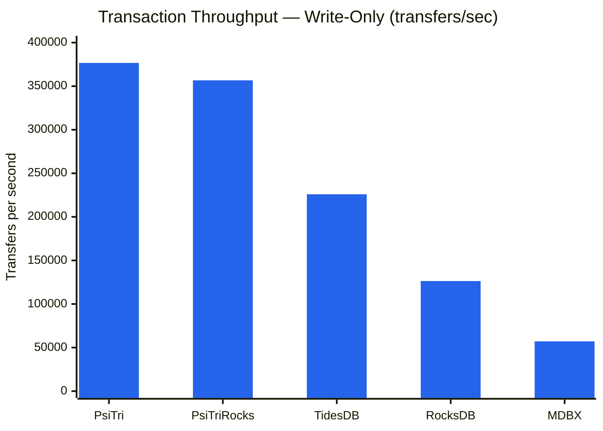
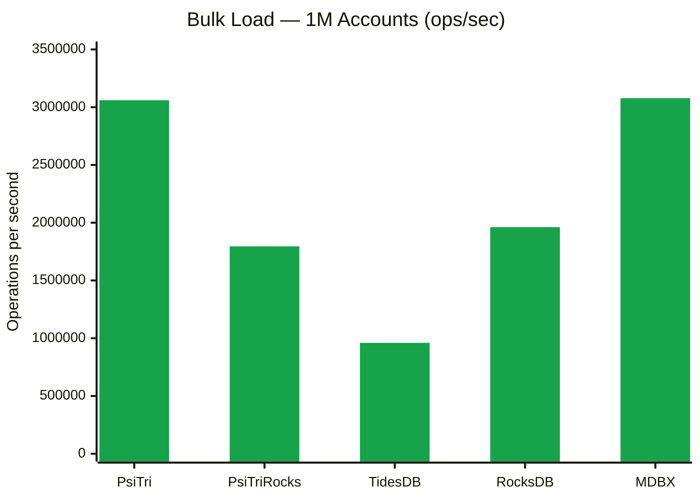
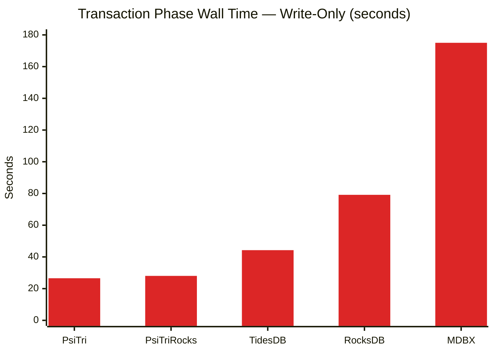
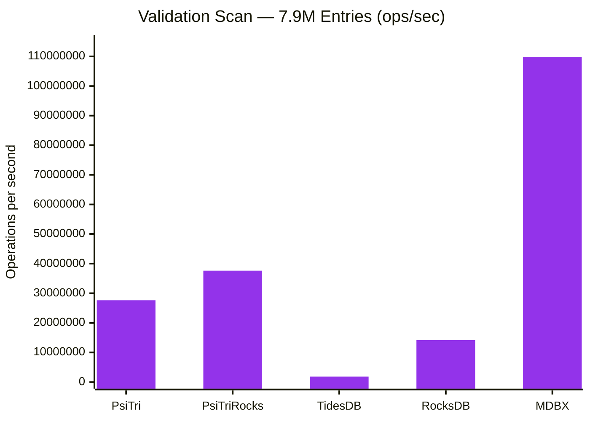
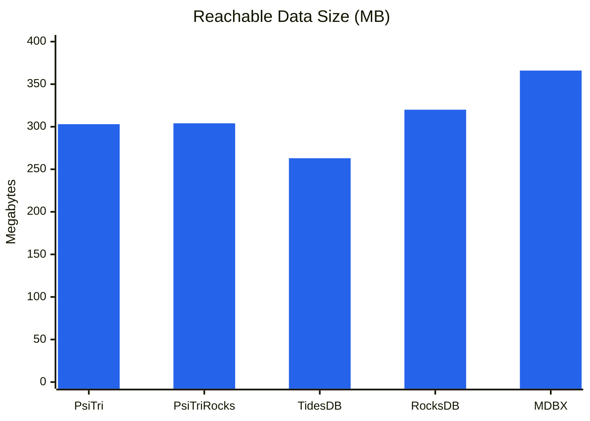
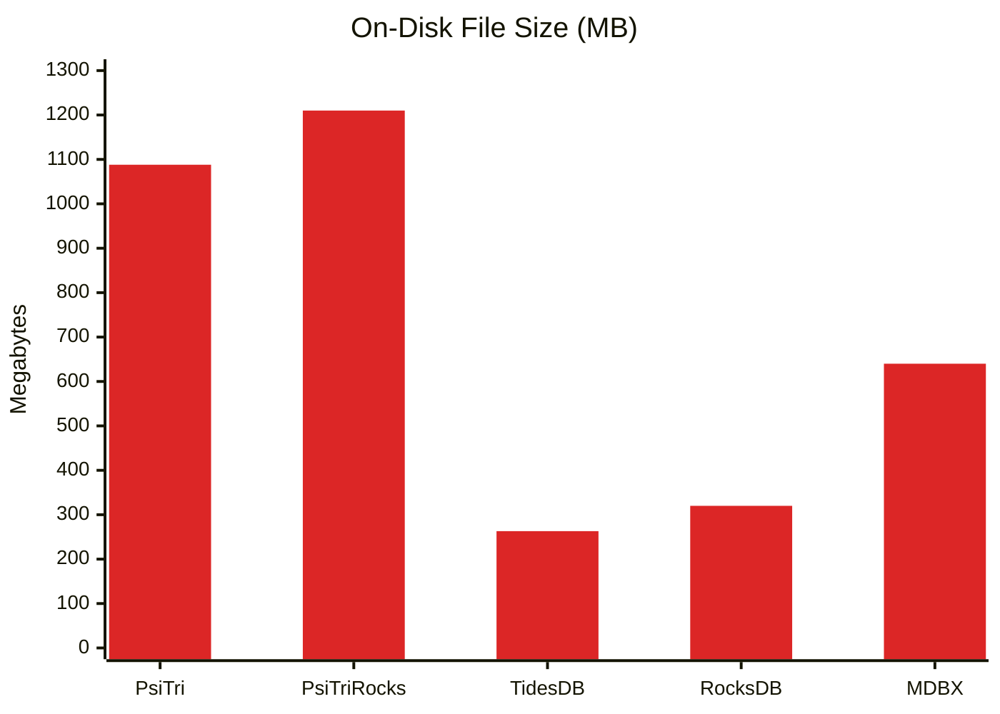
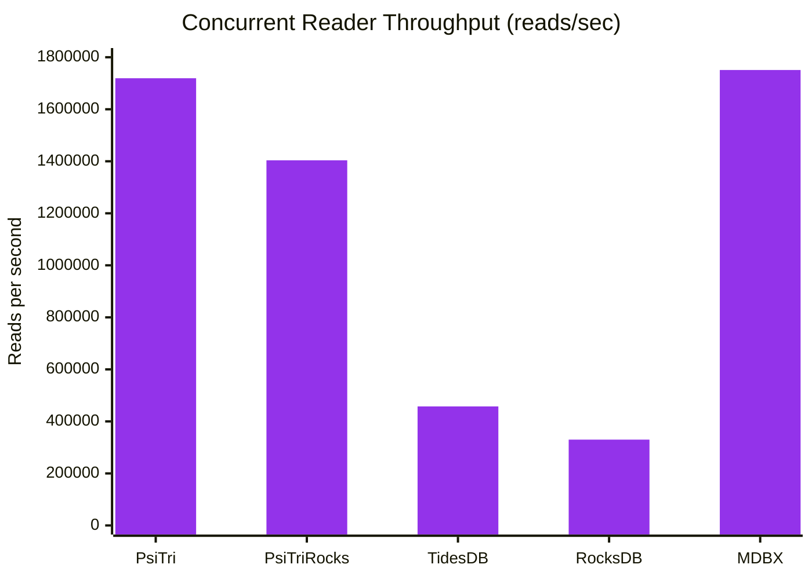
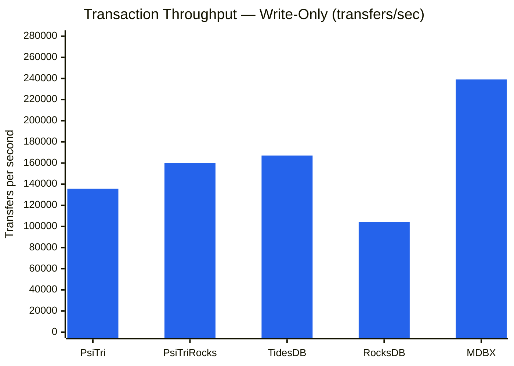

# Bank Transaction Benchmark

A realistic banking workload benchmark comparing five embedded key-value storage
engines on atomic transactional operations modeled after TPC-B.

## Workload

Each successful transfer performs **5 key-value operations** in a single atomic transaction:

1. **Read** source account balance
2. **Read** destination account balance
3. **Update** source balance (debit)
4. **Update** destination balance (credit)
5. **Insert** transaction log entry (big-endian sequence number key with transfer details)

This mirrors the TPC-B debit-credit pattern (3 updates + 1 select + 1 insert) and
exercises both random-access updates and sequential-key inserts within the same transaction.

- **1,000,000 accounts** with random names (dictionary words + synthetic binary/decimal keys)
- **10,000,000 transfer attempts per phase** (6,856,951 successful in write-only phase)
- **Triangular access distribution** -- some accounts are "hot," mimicking real-world Pareto-like skew
- **Deterministic** -- identical RNG seed ensures every engine processes the exact same workload
- **Validated** -- balance conservation and transaction log entry count verified after completion

### Fairness Controls

All engines use identical batching and sync parameters:

| Parameter | Value |
|-----------|-------|
| Batch size | 100 transfers per commit |
| Sync frequency | Every 100 commits |
| Sync mode | none (no forced durability) |
| Initial balance | 1,000,000 per account |
| RNG seed | 12345 |

## Results: Apple M5 Max (ARM64, macOS)

### Transaction Throughput

The core metric -- sustained transfers per second over 10M operations. Each successful
transfer performs 2 reads + 2 updates + 1 insert.



| Engine | Transfers/sec | KV Ops/sec | Relative |
|--------|--------------|------------|----------|
| **PsiTri** | **376,691** | **1,883,455** | **1.00x** |
| PsiTriRocks | 356,703 | 1,783,515 | 0.95x |
| TidesDB | 225,937 | 1,129,685 | 0.60x |
| RocksDB | 126,341 | 631,705 | 0.34x |
| MDBX | 57,138 | 285,690 | 0.15x |

Each transfer performs 5 key-value operations (2 reads + 2 updates + 1 insert), so the effective KV ops/sec is 5x the transfer rate.

PsiTri uses **memory-mapped copy-on-write nodes** with an arena allocator. A transfer
touches a small number of nodes already in the page cache. There is no write-ahead log,
no compaction stalls, and no memtable flush -- writes go directly to the memory-mapped
data structure.

### Bulk Load

Inserting 1M accounts with initial balances in a single batch transaction.



| Engine | Time | Ops/sec |
|--------|------|---------|
| **PsiTri** | 0.33s | **3.06M** |
| MDBX | 0.33s | 3.08M |
| RocksDB | 0.51s | 1.96M |
| PsiTriRocks | 0.56s | 1.80M |
| TidesDB | 1.04s | 0.96M |

### Transaction Time

Wall-clock time for the 10M transfer phase.



| Engine | Time | vs. PsiTri |
|--------|------|-----------|
| **PsiTri** | **26.5s** | -- |
| PsiTriRocks | 28.0s | +5.6% |
| TidesDB | 44.3s | +66% |
| RocksDB | 79.2s | +198% |
| MDBX | 175.0s | +558% |

PsiTri completes the same work in one-sixth the time MDBX requires.

### Validation Scan

Full scan reading all 1M accounts plus ~6.9M transaction log entries.



| Engine | Time | Ops/sec |
|--------|------|---------|
| **MDBX** | 0.072s | **109.9M** |
| PsiTriRocks | 0.209s | 37.6M |
| PsiTri | 0.284s | 27.6M |
| RocksDB | 0.555s | 14.2M |
| TidesDB | 4.263s | 1.84M |

MDBX dominates sequential scanning -- its B+tree stores keys in sorted order with contiguous leaf pages.

### Storage Efficiency

#### Reachable Data Size

The theoretical minimum raw data size is **275 MB**. This chart shows bytes occupied by live, reachable objects.



| Engine | Reachable Data | vs. Theoretical (275 MB) | File Size |
|--------|---------------|--------------------------|-----------|
| **TidesDB** | 263 MB | 0.96x | 263 MB |
| **PsiTri** | 303 MB | 1.10x | 1,088 MB |
| **PsiTriRocks** | 304 MB | 1.11x | 1,210 MB |
| **RocksDB** | 314 MB | 1.14x | 320 MB |
| **MDBX** | 366 MB | 1.33x | 640 MB |

PsiTri's reachable data is only 1.10x the theoretical minimum, thanks to graduated leaf node sizing.

#### File Size



PsiTri's file size is 3.6x its reachable data. The dead space consists of copy-on-write duplicates awaiting compaction and allocator free space within segments. The background compactor keeps growth bounded during sustained write workloads.

### Concurrent Read Performance

The benchmark runs a second phase with a concurrent reader thread performing Pareto-distributed point lookups.

#### Write Throughput Under Read Load

```mermaid
%%{init: {'theme': 'base', 'themeVariables': {'xyChart': {'plotColorPalette': '#2563EB'}}}}%%
xychart-beta
    title "Write Throughput: Write-Only vs Write+Read (tx/sec)"
    x-axis ["PsiTri", "PsiTriRocks", "TidesDB", "RocksDB", "MDBX"]
    y-axis "Transfers per second" 0 --> 400000
    bar [376691, 356703, 225937, 126341, 57138]
    bar [382416, 250564, 228892, 124864, 51858]
```



| Engine | Write-Only | Write+Read | Write Impact | Reader reads/sec |
|--------|-----------|------------|-------------|-----------------|
| **PsiTri** | 376,691 | **382,416** | **+1.5%** | 1,719,249 |
| PsiTriRocks | 356,703 | 250,564 | **-29.8%** | 1,403,776 |
| TidesDB | 225,937 | 228,892 | +1.3% | 457,579 |
| RocksDB | 126,341 | 124,864 | -1.2% | 329,917 |
| MDBX | 57,138 | 51,858 | -9.2% | 1,750,952 |

PsiTri shows **zero write degradation** from concurrent reads. Its memory-mapped MVCC architecture means readers access the same physical pages with no locking.

#### Reader Throughput



### Summary

| Engine | Architecture | Strength | Weakness |
|--------|-------------|----------|----------|
| **PsiTri** | Radix/B-tree hybrid, mmap copy-on-write | Fastest transactions (377K/s), zero read contention | Larger file footprint |
| **PsiTriRocks** | PsiTri via RocksDB API shim | Drop-in RocksDB replacement | 29% write penalty with concurrent reads |
| **TidesDB** | Skip-list + SSTables | Good tx speed (226K/s), compact | Slow scan, 100K txn op limit |
| **RocksDB** | LSM-tree | Compact storage, minimal read impact | 3.0x slower than PsiTri |
| **MDBX** | B+tree, MVCC copy-on-write | Fastest scan (110M/s) and reads (1.75M/s) | 6.6x slower transactions |

All five engines pass validation: balance conservation verified and transaction log entry counts match across both phases.

---

## Results: AMD EPYC-Turin (x86-64, Linux)

### Environment

| Component | Spec |
|-----------|------|
| CPU | AMD EPYC-Turin, 8 cores / 16 threads (SMT), 2.4 GHz |
| ISA extensions | SSE2, SSE4.1, SSSE3, AVX2, AVX-512F/BW/DQ/VL/VBMI/VNNI |
| RAM | 121 GB |
| Storage | 960 GB virtual disk (cloud VM — Linux 6.17, 4 KB page size) |
| Compiler | Clang 20, C++20, `-O3 -flto -march=native` |

### Transaction Throughput



| Engine | Transfers/sec | KV Ops/sec | Relative to PsiTri |
|--------|--------------|------------|--------------------|
| **PsiTri** | **135,651** | **678,255** | **1.00x** |
| PsiTriRocks | 159,938 | 799,690 | 1.18x |
| TidesDB | 167,093 | 835,465 | 1.23x |
| RocksDB | 104,102 | 520,510 | 0.77x |
| MDBX | 239,041 | 1,195,205 | 1.76x |

On this x86 cloud VM, MDBX's B+tree layout benefits from 4 KB OS pages and x86 hardware
prefetchers. The gap is largely a page-copy artifact: MDBX copies one page per write, and
4 KB pages on x86 cost 4x less than the 16 KB pages on M5 Max (see
[cross-platform comparison](#cross-platform-comparison)).

### Bulk Load

| Engine | Time | Ops/sec |
|--------|------|---------|
| **PsiTri** | **0.37s** | **2.74M** |
| MDBX | 0.45s | 2.23M |
| RocksDB | 0.86s | 1.16M |
| PsiTriRocks | 1.05s | 0.96M |
| TidesDB | 1.58s | 0.63M |

PsiTri leads bulk load on x86 — sequential arena writes benefit from AVX-512
`copy_branches` (9x speedup over scalar).

### Transaction Time (Write-Only Phase)

| Engine | Time | vs. PsiTri |
|--------|------|------------|
| **PsiTri** | **73.7s** | -- |
| PsiTriRocks | 62.5s | -15% |
| TidesDB | 59.8s | -19% |
| RocksDB | 96.1s | +30% |
| MDBX | 41.8s | -43% |

### Validation Scan

| Engine | Time | Ops/sec |
|--------|------|---------|
| MDBX | 0.38s | 38.1M |
| **PsiTri** | **0.72s** | **19.8M** |
| PsiTriRocks | 0.74s | 19.3M |
| RocksDB | 1.28s | 11.2M |
| TidesDB | 11.9s | 1.20M |

PsiTri and PsiTriRocks are nearly identical on scan, and both comfortably ahead of
RocksDB and TidesDB.

### Concurrent Read Performance

| Engine | Write-Only | Write+Read | Write Impact | Reader reads/sec |
|--------|-----------|------------|-------------|-----------------|
| **PsiTri** | 135,651 | 115,521 | -14.8% | 698,948 |
| PsiTriRocks | 159,938 | 121,276 | -24.2% | **785,868** |
| TidesDB | 167,093 | 163,275 | **-2.3%** | 326,596 |
| RocksDB | 104,102 | 87,423 | -16.0% | 223,149 |
| MDBX | 239,041 | 229,280 | -4.1% | 927,734 |

PsiTri's write impact is larger here (-14.8%) than on M5 Max (+1.5%). On the cloud VM,
memory bandwidth is more constrained, so the shared page-cache pressure from the
concurrent reader is measurable. PsiTri still delivers more reader throughput than
RocksDB and TidesDB.

### Storage

| Engine | Reachable | File Size |
|--------|-----------|-----------|
| PsiTriRocks | 558 MB | 2,298 MB |
| **PsiTri** | **562 MB** | **2,400 MB** |
| RocksDB | 567 MB | 579 MB |
| TidesDB | 675 MB | 675 MB |
| MDBX | 1,257 MB | 1,344 MB |

PsiTri and PsiTriRocks have the most compact reachable data. The larger file size
reflects COW free space awaiting compaction, consistent with the M5 Max results.

---

## Cross-Platform Comparison

The most striking cross-platform shift is MDBX, not PsiTri.

### Write Throughput: ARM M5 Max vs x86 EPYC-Turin

| Engine | M5 Max (ARM64) | EPYC-Turin (x86) | Change |
|--------|----------------|------------------|--------|
| **PsiTri** | **376,691** | **135,651** | -64% |
| PsiTriRocks | 356,703 | 159,938 | -55% |
| TidesDB | 225,937 | 167,093 | -26% |
| RocksDB | 126,341 | 104,102 | -18% |
| MDBX | 57,138 | 239,041 | **+318%** |

Every engine is slower on the x86 VM than on M5 Max — this is a cloud VM vs a
high-end workstation, so absolute numbers aren't directly comparable. What matters
is the relative ordering and the magnitude of MDBX's swing.

**Why does MDBX improve so much on x86?**

MDBX (like LMDB) uses page-level copy-on-write: every write copies the entire page
containing the modified key. On M5 Max the OS page size is **16 KB**; on x86 Linux
it is **4 KB**. Each write copies 4x less data on x86, which maps almost exactly
onto the 4.2x throughput increase. This is an OS page size effect, not an
architectural one.

**PsiTri's COW operates at 64-byte node granularity** and is indifferent to OS page
size, so it does not benefit from the same effect. Its absolute throughput drops on
the cloud VM due to higher memory access latency compared to M5 Max's Unified Memory
Architecture, but its relative standing against RocksDB and TidesDB stays consistent
across both platforms.

**Consistent patterns across both platforms:**

- PsiTri leads or ties for **bulk load** on both platforms
- PsiTri and PsiTriRocks lead **reachable data compactness** on both platforms
- MDBX leads **sequential scan** on both platforms
- PsiTri and MDBX lead **concurrent reader throughput** on both platforms
- RocksDB is consistently mid-pack on transactions

## Reproducing

```bash
# Build all engines (from repo root)
cmake -G Ninja -DCMAKE_BUILD_TYPE=Release \
      -DBUILD_ROCKSDB_BENCH=ON \
      -DBUILD_TIDESDB_BENCH=ON \
      -B build/release

cmake --build build/release -j8 --target \
      bank-bench-psitri \
      bank-bench-psitrirocks \
      bank-bench-rocksdb \
      bank-bench-mdbx \
      bank-bench-tidesdb

# Run each engine with identical parameters
for engine in psitri psitrirocks rocksdb mdbx tidesdb; do
    build/release/bin/bank-bench-${engine} \
        --num-accounts=1000000 \
        --num-transactions=10000000 \
        --batch-size=100 \
        --sync-every=100 \
        --db-path=/tmp/bb_${engine}
done
```

### CLI Options

| Flag | Default | Description |
|------|---------|-------------|
| `--num-accounts` | 1,000,000 | Number of bank accounts |
| `--num-transactions` | 10,000,000 | Number of transfer attempts |
| `--batch-size` | 1 | Transfers per commit |
| `--sync-every` | 0 | Sync to disk every N commits (0 = never) |
| `--sync-mode` | none | Durability: `none`, `async`, `sync` |
| `--seed` | 12345 | RNG seed for reproducibility |
| `--db-path` | /tmp/bank_bench_db | Database directory |
| `--initial-balance` | 1,000,000 | Starting balance per account |
| `--reads-per-tx` | 100 | Point reads per reader thread batch |

## Environment

### Apple M5 Max (ARM64)
- **Hardware**: Apple M5 Max, 128 GB Unified Memory
- **OS**: macOS (Darwin 25.3.0)
- **Compiler**: Clang 17 (LLVM), C++20, `-O3 -flto=thin`
- **Engine versions**: RocksDB 9.9.3, libmdbx 0.13.11, TidesDB 8.9.4

### AMD EPYC-Turin (x86-64)
- **Hardware**: AMD EPYC-Turin, 8 cores / 16 threads, 2.4 GHz, 121 GB RAM (cloud VM — Vultr)
- **ISA**: AVX-512F/BW/DQ/VL/VBMI/VBMI2/VNNI, AVX2, SSSE3, SSE4.1
- **OS**: Ubuntu Linux 6.17.0 x86_64, 4 KB page size
- **Compiler**: Clang 20 (LLVM), C++20, `-O3 -flto -march=native`
- **Engine versions**: RocksDB (built from source), libmdbx (built from source), TidesDB (built from source)
