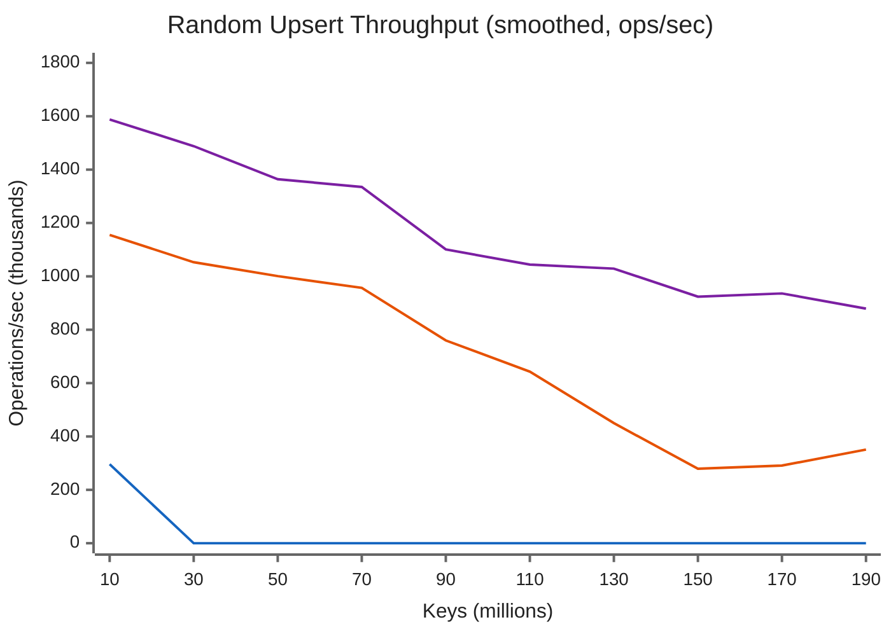
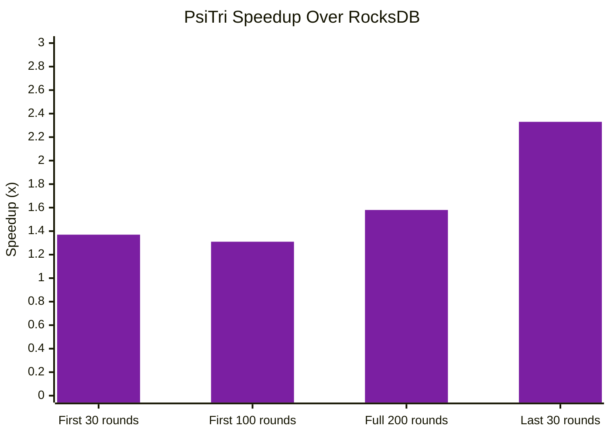

# Random Upsert Benchmark: 200M Keys

This benchmark compares sustained random write throughput across PsiTri, RocksDB, and MDBX as the dataset grows from zero to **200 million keys** -- well beyond the point where in-memory buffering helps and compaction/page management dominates performance.

## Workload

Each round inserts 1 million random key-value pairs using upsert semantics. Keys are 8-byte hashes of a sequence number (uniformly random distribution), values are 256 bytes. Writes are committed in batches of 100.

| Parameter | Value |
|-----------|-------|
| Operation | Random upsert (hashed 64-bit keys) |
| Rounds | 200 (1M ops per round = 200M total) |
| Batch size | 100 ops per commit |
| Value size | 256 bytes |
| Key size | 8 bytes |
| Concurrent readers | 0 (write-only) |

## Engine Configuration

- **PsiTri** (DWAL mode): pinned_cache=256 MB, merge_threads=2, max_rw=100K entries, sync=none
- **RocksDB**: default options (create_if_missing), WriteBatch size=100
- **MDBX**: UTTERLY_NOSYNC, commit_interval=100 ops, map_size=200 GB, MDBX_UPSERT

## Results

### Throughput Over Time



!!! note "Chart legend"
    Purple = PsiTri, Orange = RocksDB, Blue = MDBX (stopped at 20M keys)

### Summary

| Metric | PsiTri | RocksDB | MDBX |
|--------|------------|---------|------|
| Rounds completed | **200** | **200** | 20 (MAP_FULL) |
| Total ops | 200M | 200M | 20M |
| Total time | 740s | -- | -- |
| **Avg first 30 rounds** | **1,588,320/s** | 1,155,254/s | 296,806/s |
| **Avg first 100 rounds** | **1,311,423/s** | 1,000,853/s | -- |
| **Avg all 200 rounds** | **1,129,318/s** | 712,824/s | -- |
| **Avg last 30 rounds** | **909,379/s** | 390,162/s | -- |
| Peak throughput | 2,334,318/s | 1,622,951/s | 471,055/s |
| Min throughput | 24,791/s | 85,161/s | 162,650/s |
| Final DB size | 76.7 GB | 51.5 GB | MAP_FULL at 200 GB |

### PsiTri vs RocksDB Speedup

The performance gap **widens as the dataset grows**. PsiTri starts 1.37x faster and finishes 2.33x faster:



| Period | PsiTri | RocksDB | Speedup |
|--------|--------|---------|---------|
| First 30 rounds (in-RAM) | 1.59M/s | 1.16M/s | **1.37x** |
| First 100 rounds | 1.31M/s | 1.00M/s | **1.31x** |
| Full 200 rounds | 1.13M/s | 713K/s | **1.58x** |
| Last 30 rounds (beyond-RAM) | 909K/s | 390K/s | **2.33x** |

## Analysis

### PsiTri

PsiTri sustains high throughput throughout the entire 200-round run. The DWAL write buffer absorbs bursts while the background merge thread drains data into the COW trie. Periodic merge stalls cause brief drops to ~25-80K/s but recover immediately in the next round.

The key advantage is **predictable degradation**: as the dataset grows beyond RAM, throughput decreases gradually due to page cache pressure, but there are no compaction cliffs. At 200M keys (76.7 GB on disk), PsiTri still delivers 909K ops/sec averaged over the final 30 rounds.

Space amplification is ~1.6x theoretical (76.7 GB for ~49 GB of raw data), reflecting COW segment overhead and DWAL buffering.

### RocksDB

RocksDB shows strong initial throughput thanks to its LSM write-ahead-log buffering. However, it exhibits the classic **compaction stall pattern**: throughput drops to 85-125K/s every 3-5 rounds as background compaction falls behind.

Beyond round 150, throughput collapses to 200-400K/s sustained as the LSM tree grows deeper and compaction becomes the bottleneck. This is the fundamental LSM tradeoff -- deferred work eventually catches up.

RocksDB is the most space-efficient at 51.5 GB (~1.05x theoretical) thanks to SSTable compaction eliminating dead data.

### MDBX (libmdbx)

MDBX's COW B-tree cannot reclaim pages fast enough with frequent commits (every 100 ops). It hits `MAP_FULL` after only **20 million keys** despite a 200 GB map allocation -- a **10x space amplification**.

With commit_interval raised to 10,000, MDBX reaches 31M keys before `MAP_FULL`. The fundamental issue is that page-level COW (4KB granularity) creates massive write amplification on random workloads, and the freelist cannot keep pace with page allocation.

MDBX is not competitive for high-frequency random write workloads.

## Environment

| Spec | Value |
|------|-------|
| Host | Vultr VPS |
| CPU | AMD EPYC-Turin, 16 vCPUs |
| RAM | 128 GB |
| OS | Linux 6.17.0-20-generic x86_64 |
| Filesystem | ext4 (NVMe) |

## Raw Data

Per-round CSV data for charting is available in [`docs/data/random_upsert_200r/`](../data/random_upsert_200r/2026-04-06/vultr-epyc-128gb/).

## Reproducing

```bash
cmake -G Ninja -DCMAKE_BUILD_TYPE=Release \
    -DCMAKE_C_COMPILER=clang-20 -DCMAKE_CXX_COMPILER=clang++-20 \
    -DBUILD_ROCKSDB_BENCH=ON -B build/release
cmake --build build/release -j16

# PsiTri
./build/release/bin/dwal-bench --rounds 200 --batch 100 --value-size 256 \
    --mode upsert-rand --pinned-cache 256

# RocksDB
./build/release/bin/dwal-bench --rounds 200 --batch 100 --value-size 256 \
    --mode upsert-rand --engine rocksdb

# MDBX
./build/release/bin/dwal-bench --rounds 200 --batch 100 --value-size 256 \
    --mode upsert-rand --engine mdbx
```
