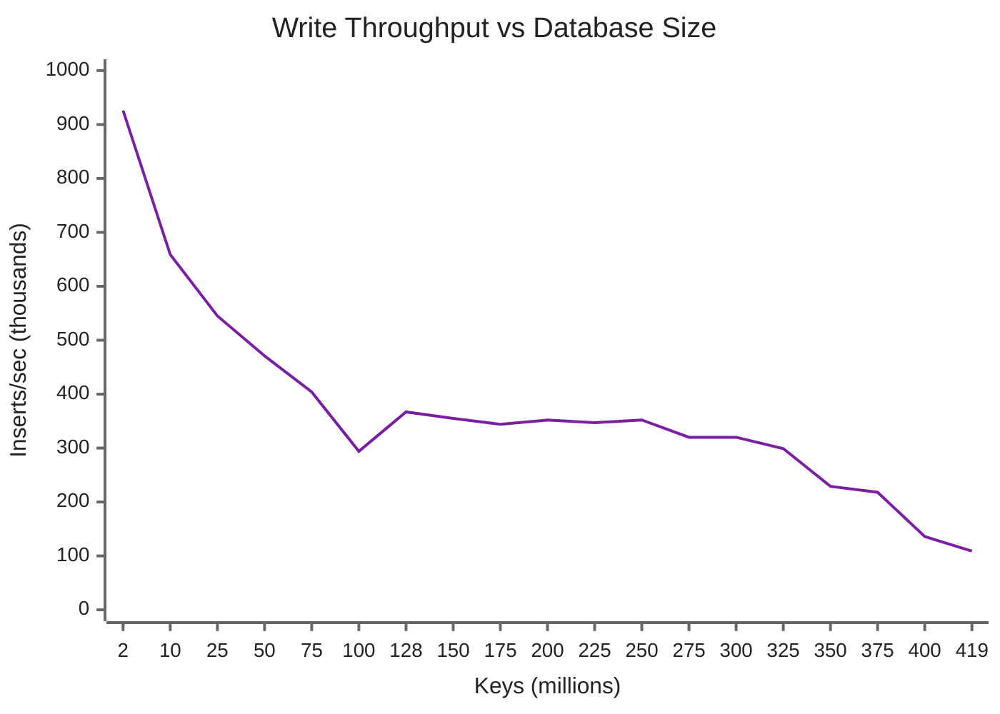
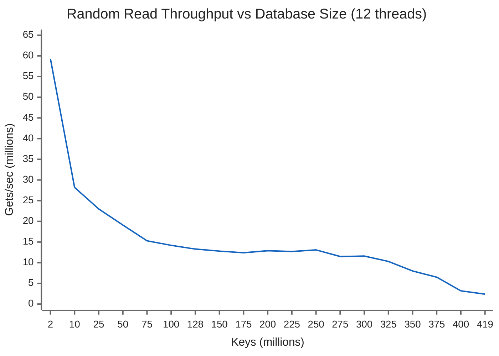

# Scale Benchmark: 419M Keys, 203 GB

This benchmark tests PsiTri's behavior as the dataset grows from zero to **419 million keys (203 GB on disk)** -- well beyond the 128 GB of available RAM. It demonstrates how performance degrades gracefully as the working set transitions from fully in-memory to disk-backed, and compares against TidesDB on the same workload.

## Workload

Each round inserts **1 million random keys** with 256-byte values in batches of 1,024. Between rounds, 12 reader threads perform random point lookups across the full key space. Both writes and reads are measured concurrently.

| Parameter | Value |
|-----------|-------|
| Keys per round | 1,000,000 |
| Total rounds | 418 |
| Total keys | 419,000,000 |
| Value size | 256 bytes |
| Batch size | 1,024 |
| Read threads | 12 |
| Sync mode | none |
| System RAM | 128 GB |
| Disk size on completion | 203 GB |

## Results

### Write Throughput



| Keys | Inserts/sec | Relative |
|------|-------------|----------|
| 2M | 926K | 1.00x |
| 50M | 471K | 0.51x |
| 128M | 367K | 0.40x |
| 200M | 352K | 0.38x |
| 300M | 320K | 0.35x |
| 400M | 136K | 0.15x |
| 419M | 109K | 0.12x |

### Read Throughput (12 Threads)



| Keys | Gets/sec (12 threads) | Per-thread | Relative |
|------|----------------------|------------|----------|
| 2M | 59.3M | 4.9M | 1.00x |
| 50M | 19.1M | 1.6M | 0.32x |
| 128M | 13.3M | 1.1M | 0.22x |
| 200M | 12.9M | 1.1M | 0.22x |
| 300M | 11.6M | 967K | 0.20x |
| 400M | 3.2M | 267K | 0.05x |
| 419M | 2.4M | 200K | 0.04x |

## PsiTri vs TidesDB

The same workload was run against [TidesDB](https://github.com/tidesdb/tidesdb), an LSM-tree based key-value store. TidesDB was configured with compression disabled (`TDB_COMPRESS_NONE`) and bloom filters enabled for a fair comparison against PsiTri (which has no compression).

### Write Throughput Comparison

```mermaid
---
config:
    theme: base
    themeVariables:
        xyChart:
            backgroundColor: "#ffffff"
            titleColor: "#222222"
            xAxisLabelColor: "#222222"
            xAxisTitleColor: "#222222"
            xAxisTickColor: "#666666"
            xAxisLineColor: "#666666"
            yAxisLabelColor: "#222222"
            yAxisTitleColor: "#222222"
            yAxisTickColor: "#666666"
            yAxisLineColor: "#666666"
            plotColorPalette: "#7b1fa2,#e65100"
---
xychart-beta
    title "Write Throughput: PsiTri vs TidesDB"
    x-axis "Scale" [Early, 100M, At-Scale]
    y-axis "Inserts/sec (thousands)" 0 --> 800
    bar [752, 352, 97]
    bar [444, 271, 227]
```



| Scale | PsiTri | TidesDB | Ratio |
|-------|--------|---------|-------|
| Early (first 10 rounds) | 752K | 444K | PsiTri 1.7x |
| ~100M keys | 352K | 271K | PsiTri 1.3x |
| At scale (last 10 rounds) | 97K | 227K | TidesDB 2.3x |
| **Average** | **327K** | **257K** | **PsiTri 1.3x** |

Writes are competitive. PsiTri starts faster but degrades more at scale as COW overhead grows with the dataset. TidesDB's LSM append-only writes are more consistent across the full range.

### Read Throughput Comparison (12 Threads)

```mermaid
---
config:
    theme: base
    themeVariables:
        xyChart:
            backgroundColor: "#ffffff"
            titleColor: "#222222"
            xAxisLabelColor: "#222222"
            xAxisTitleColor: "#222222"
            xAxisTickColor: "#666666"
            xAxisLineColor: "#666666"
            yAxisLabelColor: "#222222"
            yAxisTitleColor: "#222222"
            yAxisTickColor: "#666666"
            yAxisLineColor: "#666666"
            plotColorPalette: "#1565c0,#e65100"
---
xychart-beta
    title "Read Throughput: PsiTri vs TidesDB (12 threads)"
    x-axis "Scale" [Early, 100M, At-Scale]
    y-axis "Gets/sec (millions)" 0 --> 40
    bar [35.8, 13.9, 2.1]
    bar [1.9, 0.376, 0.06]
```



| Scale | PsiTri | TidesDB | Ratio |
|-------|--------|---------|-------|
| Early (first 10 rounds) | 35.8M | 1.9M | PsiTri 18x |
| ~100M keys | 13.9M | 376K | PsiTri 37x |
| At scale (last 10 rounds) | 2.1M | 60K | PsiTri 36x |
| **Average** | **12.6M** | **342K** | **PsiTri 37x** |
| Peak | 71.7M | 2.9M | PsiTri 25x |

PsiTri dominates reads at every scale point by **25-37x**. The fundamental difference: PsiTri resolves a point lookup with a single trie traversal through memory-mapped nodes, while TidesDB's LSM architecture must search across multiple SSTable levels.

### Storage Efficiency

| Metric | PsiTri | TidesDB |
|--------|--------|---------|
| Total keys | 419M | 576M |
| Raw data | 110.6 GB | 152 GB |
| On disk | 203 GB | 226 GB |
| Overhead | 1.84x raw | 1.49x raw |

TidesDB is more space-efficient due to its sequential SSTable layout. PsiTri's overhead comes from COW segment fragmentation and trie node structure. This is the main tradeoff for PsiTri's read performance advantage.

### Key Takeaway

For **read-heavy workloads**, PsiTri is **25-37x faster** than TidesDB with comparable write speeds. For **write-heavy workloads at extreme scale** (300M+ keys beyond RAM), TidesDB's LSM design maintains more consistent throughput. The right choice depends on your read/write ratio -- and most workloads are read-heavy.

---

## Analysis

### Three Performance Regimes

The data reveals three distinct operating regimes:

**1. In-memory (0-128M keys, 0-64 GB):** The entire working set fits in RAM. Performance degrades gradually as the tree grows deeper and the control block array gets larger, but all accesses hit memory. Writes average ~450K/sec, reads average ~18M/sec across 12 threads.

**2. Transitional (128M-325M keys, 64-160 GB):** The dataset exceeds RAM, but the MFU caching system keeps the hot inner nodes and frequently-accessed leaves pinned. The OS page cache handles the rest. Performance is remarkably stable in this range -- writes hold at ~330K/sec and reads at ~12M/sec. This is the "beyond-RAM" regime where PsiTri's design shines: there is no cliff, just a gentle plateau.

**3. Disk-bound (325M+ keys, 160+ GB):** The dataset is now ~1.6x RAM. Random reads increasingly hit disk. Performance drops more steeply as the page cache can no longer hold enough of the tree. At 419M keys (203 GB, ~1.6x RAM), reads settle at 2.4M/sec (12 threads) and writes at 109K/sec.

### Why the Transition Is Gradual

Several design decisions prevent a performance cliff at the RAM boundary:

- **Inner nodes stay hot.** At 419M keys, the tree has ~5 levels. The top 3-4 levels of inner nodes (a few hundred MB) are frequently accessed and stay in mlocked memory via the MFU caching system. Only leaf-level accesses go to disk.

- **Small nodes minimize I/O amplification.** A PsiTri leaf is ~2 KB, but the OS faults in a full 16 KB page (on Apple Silicon; 4 KB on x86). Even so, the page cache holds more useful data than a B-tree that scatters keys across 16 KB pages with low occupancy. And when multiple PsiTri nodes land on the same OS page (common for co-located siblings), a single fault satisfies multiple lookups.

- **Sequential write path.** Writes always append to the current segment. Even at 419M keys, inserts don't cause random I/O -- they fault in one new segment page sequentially. The write throughput drop is from compaction I/O competing with inserts, not from random write patterns.

- **Periodic dips are visible but bounded.** The raw data shows periodic dips (every ~10 rounds) where write throughput drops to 50-90K/sec for a single round. Between dips, writes are stable. The smoothed averages above filter these out.

### What the Periodic Dips Mean

Every ~6-10 rounds, a single round shows write throughput dropping to 50-90K/sec while read throughput drops proportionally. The exact cause is not instrumented in this benchmark -- possible contributors include segment compaction, OS page cache writeback (flushing dirty pages to disk), `mlock`/`munlock` operations on segments, or control block array growth (visible in the log as `ensure_capacity` messages that coincide with some dips). These events:

- Last exactly one round (~1 million keys worth of time)
- Do not accumulate or worsen over time
- Are bounded in magnitude (throughput recovers fully in the next round)
- The smoothed averages in the tables above filter these out

### How Close to Hardware Limits?

At 419M keys we can estimate the theoretical performance from first principles and compare to observed results.

**Data layout estimate:**

| Component | Count | Size each | Total |
|-----------|-------|-----------|-------|
| Inner nodes | ~125K | 67 B | ~8 MB |
| Leaf nodes | ~7.2M | ~2 KB | ~14.4 GB |
| Value nodes | ~419M | ~320 B (256 B value + header, cacheline-aligned) | ~134 GB |
| Control blocks | ~419M | 8 B | ~3.4 GB |
| **Total pageable (leaves + values)** | | | **~148 GB** |

With 128 GB RAM minus ~4 GB for control blocks and kernel overhead, roughly **124 GB** is available for the OS page cache. Inner nodes are trivially small (~8 MB) and stay pinned via MFU caching.

**Working backward from observed throughput:**

Each random read traverses ~5 inner nodes (all cached), then accesses 1 leaf and 1 value_node (which may or may not be cached). We can estimate the page fault rate from the observed throughput:

- Cache hit latency: ~0.5 us (tree walk through cached nodes)
- Page fault latency: ~50 us (Apple NVMe SSD)
- Observed: 200K reads/sec per thread = 5.0 us per read

Solving for fault rate *x*: `(1-x) * 0.5 + x * 50 = 5.0` gives **x = 9.1%**. About 91% of reads hit cache, 9% cause a page fault.

**I/O bandwidth consumed:**

| Metric | Value |
|--------|-------|
| Page faults/sec | 12 threads x 200K reads x 9.1% = **~218K faults/sec** |
| Bytes/sec from SSD | 218K x 16 KB (Apple Silicon page size) = **~3.5 GB/sec** |
| Apple SSD peak random read | ~5-7 GB/sec (estimated) |
| **SSD utilization** | **~50-70%** |

PsiTri is consuming roughly **half to two-thirds** of the SSD's random read bandwidth. The remaining gap is explained by:

- **Page fault overhead.** Each fault requires a kernel trap, TLB invalidation, and context switch -- fixed costs that reduce effective IOPS below raw SSD capability.
- **Synchronous faults.** Each thread blocks on its page fault. With 12 threads, the maximum I/O queue depth is 12 -- well below the hundreds of concurrent requests NVMe can handle. Asynchronous I/O or `madvise(MADV_WILLNEED)` prefetching could close this gap.
- **Concurrent writes.** The benchmark is inserting 1M keys per round simultaneously, so the compactor and writer are competing for SSD bandwidth.

**The 91% cache hit rate (vs. the naive 84% estimate)** suggests the MFU caching system is doing its job -- hot inner nodes and frequently-accessed leaves are staying pinned, giving a ~7% improvement over random eviction. At 218K faults/sec, that 7% improvement translates to ~15K fewer faults/sec, or ~240 MB/sec of avoided I/O.

### Key Takeaway

PsiTri maintains **>300K inserts/sec and >11M reads/sec (12 threads) up to 2x the size of RAM**, then degrades to I/O-bound performance beyond that. The transition is smooth -- no cliff, no stalls, no OOM. This validates the [MFU caching and beyond-RAM scaling](../architecture/caching.md) design: hot data stays in RAM, cold data pages naturally, and the copy-on-write model keeps writes sequential even when the dataset is disk-bound.

## Environment

| Component | Spec |
|-----------|------|
| CPU | Apple M5 Max (ARM64) |
| RAM | 128 GB |
| Storage | Apple SSD AP8192Z, 8 TB NVMe |
| OS | macOS (Darwin 25.3.0), 16 KB page size |
| Compiler | Clang 17, C++20 |
| Build | Release (-O3, LTO) |

## Reproducing

```bash
cmake --build build/release -j8 --target psitri-benchmark
./build/release/bin/psitri-benchmark \
    --items 1000000 \
    --value-size 256 \
    --batch 1024 \
    --db-dir /tmp/psitri_scale_bench
```

The benchmark runs until interrupted (Ctrl+C) or until the specified number of rounds completes.
