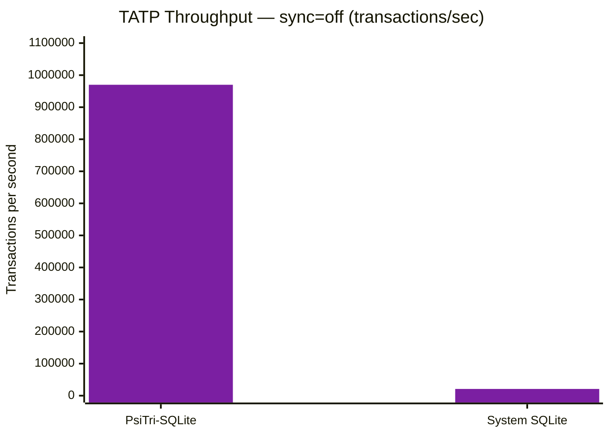
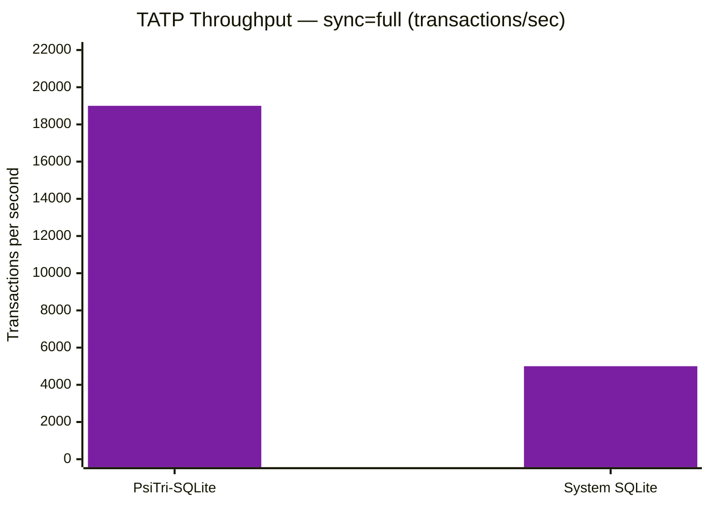

# Drop-In: SQLite API

> **Same SQL, same schema, different storage engine.** This benchmark runs
> identical `sqlite3_*` API calls -- only the B-tree implementation changes.

## What's Being Compared

- **PsiTri-SQLite**: SQLite with btree.c replaced by PsiTri's DWAL layer (`libraries/psitri-sqlite/`)
- **System SQLite**: Stock SQLite 3.x linked from the system

Both run the TATP (Telecom Application Transaction Processing) benchmark --
a standard OLTP workload with 7 transaction types across 4 tables.

## TATP Workload

| Parameter | Value |
|-----------|-------|
| Transaction mix | 35% read-only, 10% complex joins, 55% writes |
| Tables | SUBSCRIBER, ACCESS_INFO, SPECIAL_FACILITY, CALL_FORWARDING |
| Subscribers | 10,000 |
| Duration | 10 seconds |
| Concurrency | Single-threaded |

## Results

### sync=off (Maximum Throughput)



### sync=full (Durable Commits)



### Summary

| Configuration | PsiTri-SQLite | System SQLite | Speedup |
|---|---:|---:|---:|
| sync=off | 970,000 TPS | 21,000 TPS | **46x** |
| sync=full | 19,000 TPS | 5,000 TPS | **3.8x** |

### Where the Speedup Comes From

With `sync=off`, SQLite's WAL journal still performs buffered writes and
page-level B-tree mutations. PsiTri-SQLite replaces this with the DWAL's
ART buffer -- writes land in an in-memory trie with no I/O, and the
background merge thread drains to the COW trie asynchronously.

With `sync=full`, both engines call `fsync()` at commit. PsiTri-SQLite
fsyncs the DWAL's WAL file (sequential append), while system SQLite fsyncs
its WAL plus the database file. PsiTri's advantage narrows because fsync
latency dominates both paths.

### Tradeoffs

| | PsiTri-SQLite | System SQLite |
|---|---|---|
| Database format | Directory (data/ + wal/) | Single file |
| Test suite compatibility | 83% | 100% |
| `sqlite3_backup` API | Not supported | Supported |
| Incremental blob I/O | Not supported | Supported |
| Row order without ORDER BY | Trie key order | Undefined (often insertion order) |

See the [SQLite migration guide](../getting-started/sqlite-migration.md) for
full API compatibility details.

## Reproducing

```bash
# Build
cmake -G Ninja -DCMAKE_BUILD_TYPE=Release \
    -DCMAKE_C_COMPILER=clang-20 -DCMAKE_CXX_COMPILER=clang++-20 \
    -B build/release
cmake --build build/release -j16

# Run via bench framework
bench/run_all.sh tatp

# Or run directly
./build/release/libraries/psitri-duckdb/tatp-bench \
    --engine sqlite --subscribers 10000 --sync off

# System SQLite comparison (requires tatp-bench-system-sqlite target)
./build/release/libraries/psitri-duckdb/tatp-bench-system-sqlite \
    --engine sqlite --subscribers 10000 --sync off
```

## Raw Data

Results are stored in `docs/data/tatp/<date>/<machine>/`.
