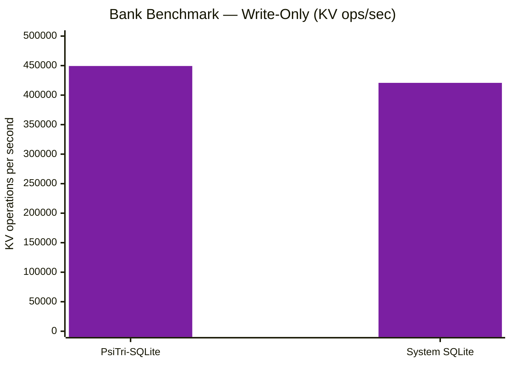
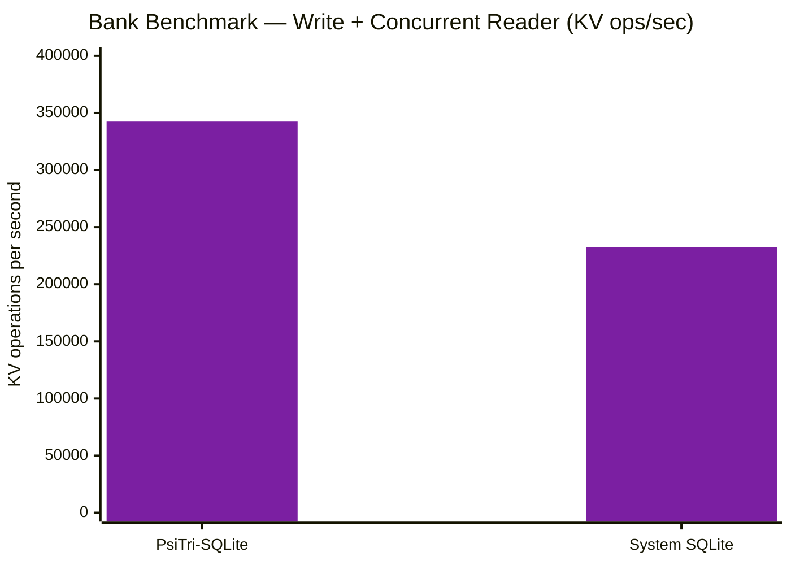

# Drop-In: SQLite API

> **Same SQL, same schema, different storage engine.** This benchmark runs
> identical `sqlite3_*` API calls -- only the storage layer changes.

## What's Being Compared

- **PsiTri-SQLite**: SQLite with btree.c replaced by PsiTri's DWAL layer (`libraries/psitri-sqlite/`)
- **System SQLite**: Stock SQLite 3.x linked from the system

Both use the same benchmark binary (`bank_bench.cpp`), the same SQL
schema, and the same workload. The only difference is which library
is linked.

## Architecture

PsiTri-SQLite replaces SQLite's B-tree page storage with PsiTri's
DWAL (Dynamic Write-Ahead Log) backed by an ART (adaptive radix trie)
buffer. All SQLite tables and indexes share a single DWAL root with
4-byte table ID key prefixes, giving atomic cross-table snapshot
consistency.

```
Application
  |
sqlite3_* API (unchanged)
  |
VDBE / Code Generator / Parser (unchanged)
  |
sqlite3Btree* interface
  |
btree_psitri.cpp  <-- replaces btree.c
  |
PsiTri DWAL root 0 (all tables share one key space)
  [table_id: 4 bytes] [key bytes] → value
```

## Bank Transaction Benchmark

Each transfer performs **5 key-value operations** (2 reads + 2 updates
+ 1 insert) in a single atomic transaction. 10,000 accounts, 100,000
transfers, per-transfer commit (batch=1).

### Write Throughput



| Engine | Transfers/sec | KV Ops/sec |
|--------|---:|---:|
| **PsiTri-SQLite** | **89,864** | **449,320** |
| System SQLite | 84,153 | 420,765 |

### Concurrent Read + Write



| Engine | Transfers/sec | KV Ops/sec | Write Impact | Reader reads/sec |
|--------|---:|---:|---:|---:|
| **PsiTri-SQLite** | **68,489** | **342,445** | **-24%** | **402K** |
| System SQLite | 46,466 | 232,330 | -45% | 165K |

PsiTri-SQLite delivers **1.47x more write throughput under concurrent
reads** and **2.4x faster reader throughput**. The DWAL's buffered
read mode gives readers a consistent snapshot without blocking the
writer -- readers never contend with writes.

### INSERT Micro-Benchmark

Pure INSERT throughput (100K inserts, no reads, `PRAGMA synchronous=OFF`):

| Mode | PsiTri-SQLite | System SQLite | Ratio |
|---|---:|---:|---:|
| INTKEY autocommit | **709K/sec** | 86K/sec | **8.2x** |
| INTKEY batched | 1,056K/sec | **4,778K/sec** | 0.22x |
| TEXT PK autocommit | **574K/sec** | 80K/sec | **7.2x** |
| TEXT PK batched | 558K/sec | **2,124K/sec** | 0.26x |

PsiTri-SQLite dominates autocommit (the realistic per-transaction
pattern) because the DWAL's ART buffer makes each commit ~100ns vs
SQLite's WAL write overhead. System SQLite wins on large batches
because its B-tree insert has no per-op undo log or WAL append.

### Tradeoffs

| | PsiTri-SQLite | System SQLite |
|---|---|---|
| Per-commit cost | ~100ns (ART buffer) | ~12us (WAL write) |
| Concurrent readers | Zero writer impact | Blocks during checkpoint |
| Database format | Directory | Single file |
| Test suite | 83% pass rate | 100% |
| Reader freshness | Bounded by flush interval (1s default) | Immediate |

## Reproducing

```bash
# Build
cmake -G Ninja -DCMAKE_BUILD_TYPE=Release \
    -DCMAKE_C_COMPILER=clang-20 -DCMAKE_CXX_COMPILER=clang++-20 \
    -DBUILD_SQLITE=ON -B build/release
cmake --build build/release -j16

# PsiTri-SQLite
./build/release/bin/bank-bench-psitri-sqlite \
    --num-accounts=10000 --num-transactions=100000 --batch-size=1

# System SQLite (for comparison)
./build/release/bin/bank-bench-system-sqlite \
    --num-accounts=10000 --num-transactions=100000 --batch-size=1

# INSERT micro-benchmark
./build/release/libraries/psitri-sqlite/psitri-sqlite-smoke
```
