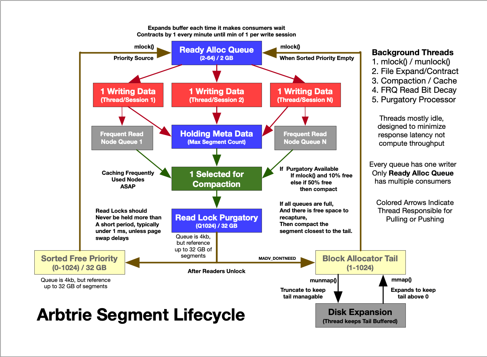

# Caching Algorithm

The goal of caching is to minimize the number of disk page swaps and because they hurt
both performance and SSD wear. Therefore, frequently modified pages and most frequently
read data should resided on memory segments pinned to RAM. Furthermore, data should be
grouped together with other data that is accessed with similar frequency so that when a
page swap does occur it itsn't bringing along unnecessary data.

By default, with no caching algorithm, the pages loaded into memory will be determined by
the operating system and the operating system utilizes a Least Recently Used (LRU)
eviction policy on a 4KB page. Furthermore, the OS may not be as agressive at keeping 
data in memory. 

By pinning data to memory with `mlock()` we reduce OS page swapping which both utilizes
limited disk IO operations and wears the SSD; therefore it is critical that frequently
modified data is pinned to RAM with `mlock()` and that we avoid modifying data at rest. An
unmodified page shouldn't cause SSD wear or utilize IO operations.

For this reason it is critical that rarely used data gets moved as far away as possible
from heavily used data and that static content stays away from dynamic content. 

## Copy on Write
Arbtrie utilizes copy on write approach which enables all writes to be contigious and
prevents modification of data at rest. Reacently written nodes are also likely to be
modified again. This is both faster than scattered writes and easier to sync to disk.

## Segment Architecture 
Arbtrie manages memory in blocks of 32 MB. Each thread writes in append-only mode to its
own 32 MB buffer. Once full and synced to disk the buffer is considered immutable and any
attempt to modify a node in the buffer results in a COW. This COW is the equivalent of
forcing writes from disk cache into memory cache. 

## Compaction
Statistics are gathered as data is freed from each segment (meta data stored seprately) so
that a segment can be recycled once a certain percentage of the segment is empty. This has
the effect of grouping "modified" data and "static" data. Compaction produces write
amplification as data is copied from one place to another; however, there is minimal
write amplification for compacting data from one pinned memory region to another. Unless
you are using the pestimistic `msync` mode.

Furthermore, empty space in pinned segments is a waste of precious cache; therefore, the
compactor is more aggressive about compacting (defragmenting) pinned memory segments 
to recover as little as 10% of free space, but is more lazy about compacting segments 
that are not pinned because disk space is relatively plentiful.

As much as possible the pinned memory segments should remain pinned and avoid pinning and
unpinning.  This is because `mlock()` and `munlock()` can be expensive.

## Most Frequently Read Data

A linear scan of the database can thrash a LRU cache by keeping data in cache that will
never be seen again. Even completely random access is likely to evict more likely nodes
for more recent nodes. Therefore, it is desirable to organize data pinned in memory by
frequency of access. This will minimize page swaps. 

Because the operating system is already implimenting a LRU caching algorithm for the pages
that are not pinned to memory, the ultimate result is a hybrid where Arbtrie gets to pick
the percentage of system memory reserved for the most frequently used data vs the most
recently used data. 

Every time a node is read (via a lookup) there is a "1 in N" chance that it will update the
node's meta data and set the 'read bit'. If the read bit was already set, then it will set a
flag in the node's meta data to promote it to the pinned cache, and finally push the
address of the node into a per-session (aka per-thread) queue for the compactor to pick
up.

The compactor is fairly agressive at checking these queues and moving the objects in them
to the compactor's own pinned write segment. This is a background thread so this effort
has little impact on query performance.  

Over time all data would end up with the 'read bit' set to 1, except for the fact that
another background thread is periodically clearing the 'read bit'. For an item to be moved
into the cache it must be read an average of N^2 times before each clearing of the 'read bit'.
This is because each read has a probability of 1/N so two reads in a given window has
a probability of 1/N^2. 

Once the compactor has moved data it clears the read bit, allowing the cycle to repeat.
This clearing of the bit will only happen if the node is close to being evicted, otherwise
the node will be promoted from the "warm" pinned memory to the "hot" pinned memory, buying
it more time in the cache.

The goal is to adjust N and the window period such that at any given moment the amount of
data with the 'read bit' set is equal to the desired amount of pinned RAM. If N is to high
and the window is too small there won't be any data qualifying. If N is too low or the
window too long, then all data could qualify. A third variable is the amount of pinned
RAM, the more pinned RAM you have is the same as increasing N (it becomes harder to fill)
and potentially everything could fit in pinned RAM.

## Segment Eviction

When it comes time to allocate a new segment it will typically want to write into pinned
memory, with the exception of the compactor moving cold data to more compact form of cold
data. In the later case, the compactor wants a memory segment configured with
`madvise(MADV_SEQUENTIAL)` to enable the OS to load the data that the compactor is rapidly
filling while letting the OS know to quickly evict the pages again after the compactor has
written them. Once the compactor has completed this segment it should reset `madvise()` to
be the OS default. 

Therefore, most new segment allocs will require a new `mlock()` and the eviction of an
existing `mlock()` segment. Every segment is assigned an age when it is allocated; therefore,
we can evict the oldest pinned memory segment. Hot data will be copied regularly to
younger segments whether it is being writen to due to COW or because the session 
read queue frequently promoting it to the head of the class. 

The following diagram shows the segments sorted by age (not by file position); however,
for scale, it also shows the percentage of the database that each type of segment would
occupy if they were sorted on disk in the order of their age. In practice, the 32MB and their
memory flags would be mixed together in the file, hopefully with a bias towards this 
ideal sort order.

<pre>

            Frequently Used Cache         RLU OS Cache        Mapped Reserve  EOF
  
   young  |-    Hot   -|-   Warm  -|----     Cold      ----|- Prunable Tail  -| old
          |                        |                       |                  |
    age   |----     mlock      ----|---- MADV RANDOM  -----|-   MADV FREE    -| age
          |                                                                   |
          |-      Lowest Age Alloc     -|- Alloc Earliest -|- Alloc Earliest -|
          |                             |                                     |
          |--- minimal compacted size --|------  prunable with compact -------|
  
</pre>

The data in the 'hot' segments does not get considered for read-bit promotion because it
would produce too much unnecessary copying. As data ages it enters the 'warm' bucket without
having to be copied simply because more and more newly allocated segments have higher 
segment numbers. Once in this zone, if the read bit is set and then detected set it will
be put into the queue and copied to the head of the class in to a brand new 'hot' baby
segment. To stay in pinned memory the data must be read an average of N^2 times in the time it
takes for write demand to allocate the number of segments in the 'warm' zone. 

Once it leaves pinned memory it is subject to the OS LRU caching algorithm. 

## Age of Compacted Data

Each segment actually has two ages. One age used for recovery (for version control), and
another 'virtual age' used by the caching algorithm. The virtual age works in a similar
manner to the versioning age, incrementing on each new segment allocation, except that the
compactor is free to create synthetic non-integer ages. The virtual age of a segment
produced by the compactor is the weighted average of the virtual age of the objects being
copied to the compacted segment. This minimizes the impact on the sort order caused by
compacting pinned segments to recover freed data. Freed data being the least likely to
every be accessed!

In order to minimize the virtual-age promotion or demotion as a result of compacting,
the compactor should identify the set of segments that qualify for compaction and then
process them in virtual-age order starting with the segment closest to the weighted
average age of the new segment being populated.

## Priority of Recycled Segment Reuse
As the database adds and removes data it is desirable to be able to
reduce the size of the database on disk; therefore, segments closer to
the start of the file could have priority over segments further from the
start of the file.

That said, segments that are more likely to contain pages in the OS cache 
will minimize swapping required when pinning the new segment to memory. Performance
would suggest using the segment that contains the youngest virtual age and
size would suggest using the segment that is closest to the front of the file.

The organic patterns of the database will produce rise and fall of the minimal size
of a perfectly defragmented database. Segments within this minimal set cannot 
be pruned unless the total data shrinks. Therefore, we prioritize these segments
sorted by youngest virtual age for allocation. 

If there are no empty segments within this region, then we prioritize the block
that is closest to the head of the file to maximize the probability that we can
eventually reclaim disk space. If a segment becomes empty and is part of the
prunable tail of the file, then it is set aside for truncation when the program
exits. In the event that all other segments get utilized by the allocator, then
segments are selected from the start of the prunable tail. As a last resort, the
file will grow.

## Preventing Blocking Delays
Calls like `mlock()` and `munlock()` can block the calling thread for a long time. 
and so can extending the file and mapping memory into it; therefore, the background
thread proactively maps segments into memory in the tail before they are needed, and
proactively keeps empty spare pinned memory segments ready to be assigned.

The number of reserve segments of both types dynamically adjusts based upon the
number of times an an allocation is requested and the caller is forced to wait.
This is a sign that demand for new mapped or pinned memory segments is outpacing the
supply of recycled segments. 

## Segment Lifecycle

## Summary and Conclusion

The Arbtrie caching algorithm combines several strategies to optimize memory usage and minimize disk I/O:

1. **Hierarchical Memory Management**
   - Hot data (frequently accessed) -> Pinned RAM with mlock()
   - Warm data (moderately accessed) -> Pinned RAM, subject to aging
   - Cold data (infrequently accessed) -> OS-managed LRU cache
   - Prunable data (empty,pending) -> Disk with MADV_FREE

2. **Key Optimizations**
   - Copy-on-Write prevents modification of data at rest
   - Probabilistic read-bit tracking (1/N chance) identifies frequently accessed data
      - N dynamically tuned to mark desired amount of data for pinned RAM
   - Background compaction consolidates data by access patterns
   - Dynamic segment allocation with proactive reserves prevents blocking
   - Virtual age tracking enables intelligent data placement

3. **Performance Benefits**
   - Minimizes SSD wear through strategic data placement
   - Reduces page swaps by grouping data by access frequency
   - Optimizes memory usage through intelligent pinning
   - Enables database size reduction through tail pruning
   - Prevents cache thrashing from linear scans

The algorithm achieves these benefits while maintaining several important properties:
- Non-blocking operation through proactive segment management
- Automatic adaptation to workload patterns
- Efficient use of both RAM and disk space
- Minimal write amplification
- Graceful handling of database growth and shrinkage

This sophisticated caching strategy allows Arbtrie to provide high performance for both read and write operations while efficiently managing system resources and minimizing wear on storage devices. The combination of probabilistic tracking, background optimization, and hierarchical storage management creates a robust and adaptable system suitable for a wide range of workloads.

# Grok 3 Deep Search Results

After writing the above, I decided to utilize Deep Search to discover existing research
on studies of caching algorithms similar to the one I've implemented:

## _Baek S, Cho S, Choi J (2017) [Don’t make cache too complex: A simple probability-based cache management scheme for SSDs.](https://journals.plos.org/plosone/article?id=10.1371/journal.pone.0174375) 
<i>PLoS ONE 12(3): e0174375. https://doi.org/10.1371/journal.pone.0174375</i>

This paper utilizes random number to determine if a query should be put into cache and
shows the effects of different N values. The primary conclusion is that large values of N,
or high difficulty promotes better cache performance over the long term, but is not as
effective for short term warm up. 

The other idea that the paper mentions is changing the difficulty of getting a node into
the cache according to its size. Larger nodes tend to be less frequently accessed and it
would be possible to get two or more smaller nodes in the same space. Taken another way,
a larger node that is 3x the size of other nodes with similar probability of being accessed 
should have a difficulty of the combined probability of 1 of the 3 smaller nodes being hit.

There being 3x as many smaller nodes means that they are 3x more likely to be queried than
the single larger node assuming each node is accessed with the same frequency. Bigger
nodes are also more costly to move, so it is best if they settle to the bottom. 

# Software Design

There are two bits utilized in the 64 bit atomic `node_meta` structure that faclitiates locking
and moving the nodes location in memory. The first bit is the `read bit` which gets set
with a probability of 1/(N * Size) where size is the number of CPU cachelines the node 
spans. The second time a node is randomly selected to set the 'read bit' and it discovers
it already set, it gets placed into a per-session (aka per thread) circular buffer to
be processed by the compactor. All of this "bit setting" is only done if the node is currently
on a segment marked as "warm". The top P youngest segments are mlocked and the top half
are considered "hot" and the bottom half are considered "warm". 

The compactor is responsible for moving data in the background without blocking the
access of data by any query thread. Once a compactor has copied all data from a segment
to a new segment the segment must be put into a queue until all readers confirm that they
are also done with the segment. At this point the segment is elegible for reuse.

The compactor then takes these reusable segments and sorts them by (position, virtual age),
this can be a partial sort because we only need to know which segments would be in use if
the database was completely compacted. This is tracked by keeping track of the total allocated
bytes that haven't been freed yet. We then sort the bottom half by virtual age and the top
half by position.  The bottom half of the list is considered "needed" and the top half of the
list is considered "prunable", because if we defragmented the database the prunable segments
could be truncated to reclaim disk space.

Any segment that is contigious with the empty segments at the tail of the file are put aside
until all reusable segments are consumed.

The compactor thread will be the sole thread that manages the sorted list of free segments,
but it will proactively stock a queue of segments that can be consumed by other threads as
they request a new segment. This queue will be populated with enough ready segments that
the consumers (allocating threads) should rarely have to block waiting for a new segment, but
in the event that they do end up blocking and waiting the compactor will increase the number of
pending segments in the queue to keep up with demand. 

The compactor can check the queue depth after every object is copies to minimize the latency of
pushing a new segment into the queue. Based upon this reality, the compactor should not take
on the responsibility of growing the file or mlocking / munlocking segments because these operations
could block for far longer than the compactor should wait to keep the queue full. 

There is another background thread that is responsible for decaying the read bits of nodes and
it has to periodically sleep and is not hurt by delays. This thread can review the segments and
mlock any segment that should be but isn't mlocked and munlock any segment that shouldn't be locked
but is. Furthermore, this thread can be responsible for extending the file well in advance of
any allocator catching up to it. This way the compactor is never waiting on file growth to push
segments into the queue so that allocators don't have to wait. Alternatively we could just have 
dedicated threads for each of these tasks and let them yield often. That way the OS can schedule 
them with premption. 

When a request for a new segment is made we pop from the front of this list. Because many 
threads  

The size of the existing segment reuse buffer is large enough to hold all segments that could
ever be allocated; therefore, it will be mostly empty when used only to track the segments locked.

Since the compactor is free to neglect recylcing segments and instead allow the file to grow, this
ciruclar buffer can be shrunk to the maximum number of segments in read-lock purgatory before the
compactor gives up on recylcing and starts pulling new segments from the tail of the file. Typical
read lock times should be measured in milliseconds, especially once we get incremental recursve
release implemented. A queue of 1024 segments would allow 32 GB of read-locked segments and only
require a single 4k memory page for the queue.  Likewise, a "ready queue" of segments to be plucked
by the allocator with the ease of an atomic increment that was 64 long would likely be overkill 
unless we are stuffing data into the database at a rate of GB per second, and that simply isn't
sustainable.   

read_lock_queue_size = 1024 segments before compactor waits
alloc_queue_size     = up to 64 ready to claim segments (2 GB)
segment_metadata     = 4 million (max_segment_count) * metadata per segment...
                      This could be dynamically sized based upon the actual number of segments, 
                      similar to how regions work
      - includes state info like, is mlocked, is warm, is hot, is prunable, is empty, is pending..
 
 Lastly we need the sorted free list.  These are the segments that are not in the tail and
 not in the pending alloc queue. Furthermore, they are not in active use; therefore, they should
 ideally be a small fraction of the total number of segments. In the event that this list gets
 full the compactor would have the option of compacting the segments before the tail. This would
 allow segments to flow from the sorted priority reuse list into the pending alloc queue and the
 freed tail would be pushed back to the block allocator for truncation. 

