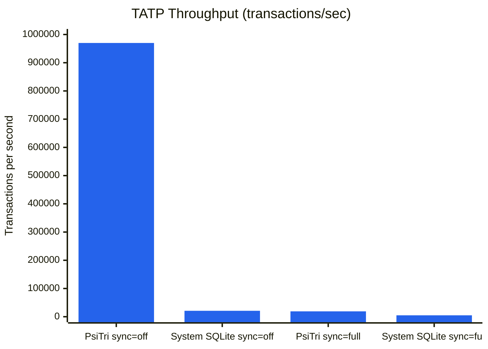

# SQLite Drop-In Migration

PsiTri-SQLite replaces SQLite's B-tree storage engine with PsiTri's DWAL layer while keeping the full `sqlite3_*` API unchanged. Your existing SQL, prepared statements, and application code work as-is -- just relink against `psitri-sqlite` instead of system SQLite.

## Quick Migration

**Before (system SQLite):**
```cmake
find_package(SQLite3 REQUIRED)
target_link_libraries(myapp PRIVATE SQLite::SQLite3)
```

**After (PsiTri-SQLite):**
```cmake
# From within the arbtrie project tree
target_link_libraries(myapp PRIVATE psitri-sqlite)
target_include_directories(myapp PRIVATE
    ${CMAKE_SOURCE_DIR}/libraries/psitri-sqlite/sqlite3)
```

Your application code stays the same:

```cpp
#include <sqlite3.h>

sqlite3* db = nullptr;
sqlite3_open("/tmp/mydb", &db);

sqlite3_exec(db, "CREATE TABLE users(id INTEGER PRIMARY KEY, name TEXT)",
             nullptr, nullptr, nullptr);
sqlite3_exec(db, "INSERT INTO users VALUES(1, 'alice')",
             nullptr, nullptr, nullptr);

sqlite3_stmt* stmt = nullptr;
sqlite3_prepare_v2(db, "SELECT * FROM users", -1, &stmt, nullptr);
while (sqlite3_step(stmt) == SQLITE_ROW) {
    int64_t id = sqlite3_column_int64(stmt, 0);
    const char* name = (const char*)sqlite3_column_text(stmt, 1);
    printf("id=%lld name=%s\n", id, name);
}
sqlite3_finalize(stmt);
sqlite3_close(db);
```

## How It Works

PsiTri-SQLite replaces SQLite's `btree.c` at the internal `sqlite3Btree*` interface level. The SQL parser, code generator, and VDBE execute unchanged -- only the storage layer is swapped:

```
Application
  |
sqlite3_* API (unchanged)
  |
VDBE / Code Generator / Parser (unchanged, SQLite 3.51.3)
  |
sqlite3Btree* interface (~50 functions)
  |
btree_psitri.cpp  <-- replaces btree.c
  |
PsiTri DWAL (adaptive write buffer + COW trie)
```

Each SQLite table or index maps to a separate DWAL root:

- **Root 0** -- metadata (schema version, encoding)
- **Root 1** -- `sqlite_schema` (hardcoded by SQLite)
- **Roots 2+** -- user tables and indexes

## PRAGMA Synchronous Mapping

`PRAGMA synchronous` maps directly to PsiTri sync levels:

| PRAGMA Value | PsiTri Sync | Behavior |
|---|---|---|
| `synchronous=OFF` | `none` | No flush. Data persists at OS discretion. Fastest. |
| `synchronous=NORMAL` | `msync_async` | Write buffer flushed, no fsync. |
| `synchronous=FULL` | `fsync` | `fsync()` at commit. Survives OS crash. |
| `synchronous=EXTRA` | `fsync` | Same as FULL. |
| `fullfsync=ON` | `full` | `F_FULLFSYNC` at commit. Survives power loss (macOS). |

Sync is applied once per SQLite transaction commit, not per individual statement.

## What's Supported

| API | Status | Notes |
|-----|--------|-------|
| `sqlite3_open` / `sqlite3_close` | Supported | Database path becomes a directory |
| `sqlite3_exec` | Supported | |
| `sqlite3_prepare_v2` / `sqlite3_step` / `sqlite3_finalize` | Supported | |
| `CREATE TABLE` / `DROP TABLE` / `ALTER TABLE` | Supported | |
| `INSERT` / `UPDATE` / `DELETE` | Supported | |
| `SELECT` with `JOIN`, subqueries, CTEs | Supported | |
| `BEGIN` / `COMMIT` / `ROLLBACK` | Supported | |
| `CREATE INDEX` / `DROP INDEX` | Supported | |
| Prepared statement binding | Supported | All `sqlite3_bind_*` functions |
| `sqlite3_column_*` accessors | Supported | All types |
| Aggregate functions | Supported | COUNT, SUM, AVG, etc. |
| Window functions | Supported | |
| PRAGMA synchronous | Supported | Maps to PsiTri sync levels |

## What's Not Supported

| Feature | Status | Workaround |
|---------|--------|------------|
| `sqlite3_backup` API | Not supported | Export via SQL, re-import |
| Incremental blob I/O (`sqlite3_blob_*`) | Returns SQLITE_READONLY | Use INSERT/UPDATE |
| Shared cache mode | Disabled | Each connection is isolated |
| `sqlite3_changes()` | Returns 1 | Don't rely on affected row counts |
| SAVEPOINT | No-op | Use separate transactions |

## Important Differences

### Database is a directory

PsiTri-SQLite databases are **directories**, not single files. Opening `/tmp/mydb` creates:

```
/tmp/mydb/
  data/      -- PsiTri segment files
  wal/       -- DWAL write-ahead log files
```

Backup and deployment strategies must account for this -- copy the entire directory, not a single file.

### Row order

Queries without `ORDER BY` return rows in **trie key order** (sorted by encoded key) rather than insertion order. This is not a bug -- SQL does not guarantee order without `ORDER BY`. Always use explicit `ORDER BY` if order matters.

### Single writer per table

Concurrent writes to the same table serialize at the DWAL level. Multiple connections can read concurrently without blocking each other or the writer.

## Performance

### TATP Benchmark (Telecom Workload)

The TATP benchmark models a telecom subscriber database with a realistic mix of reads and writes (80% reads, 20% writes). 10,000 subscribers, single-threaded:



| Configuration | TPS | vs System SQLite |
|---|---:|---:|
| **PsiTri-SQLite sync=off** | **970,000** | **46x faster** |
| System SQLite sync=off | 21,000 | baseline |
| **PsiTri-SQLite sync=full** | **19,000** | **3.8x faster** |
| System SQLite sync=full | 5,000 | baseline |

The speedup comes from replacing SQLite's page-level B-tree with PsiTri's node-level COW trie and DWAL write buffer. With `sync=off`, PsiTri avoids the WAL journal overhead entirely. With `sync=full`, PsiTri's fsync is applied to DWAL files rather than SQLite's journal, reducing the number of fsyncs per transaction.

### When to Use PsiTri-SQLite vs Native PsiTri

PsiTri-SQLite is ideal when you want **SQL compatibility** and a **familiar API** with better performance. For maximum throughput, the native PsiTri API avoids the SQL parsing and VDBE overhead entirely:

| API | Writes/sec | Use Case |
|-----|-----------|----------|
| Native PsiTri | 1.9M ops/sec | New applications, maximum performance |
| PsiTri-SQLite | 970K TPS | Existing SQLite apps, SQL compatibility |
| System SQLite | 21K TPS | Baseline |

See the [API Reference](api.md) for the native C++ interface and [Examples](../examples.md) for runnable code.

## Building

PsiTri-SQLite is built as part of the PsiTri project:

```bash
cmake -G Ninja -DCMAKE_BUILD_TYPE=Release -B build/release
cmake --build build/release
```

The library is available as `libpsitri-sqlite.a` and the `psitri-sqlite` CMake target.

To run the TATP benchmark:

```bash
# PsiTri-SQLite
cmake --build build/release --target tatp-bench
./build/release/libraries/psitri-duckdb/tatp-bench --engine sqlite \
    --subscribers 10000 --sync off

# System SQLite (for comparison)
cmake --build build/release --target tatp-bench-system-sqlite
./build/release/libraries/psitri-duckdb/tatp-bench-system-sqlite --engine sqlite \
    --subscribers 10000 --sync off
```

## Test Suite Compatibility

PsiTri-SQLite passes **83% of SQLite's TCL test suite** (~5,255 of ~6,300 test cases). Most failures are in areas where PsiTri's storage semantics differ from btree.c (row ordering without ORDER BY, `sqlite3_changes()` counter, btree/pager internals probing).

To run the test suite:

```bash
# One-time setup: clone SQLite sources
git clone --depth 1 --branch version-3.51.3 \
    https://github.com/sqlite/sqlite.git external/sqlite-src
cd external/sqlite-src && mkdir -p bld && cd bld && ../configure && make parse.h opcodes.h keywordhash.h

# Build and run
cmake --build build/release --target psitri-testfixture
bash libraries/psitri-sqlite/tests/run_sqlite_tests.sh
```
