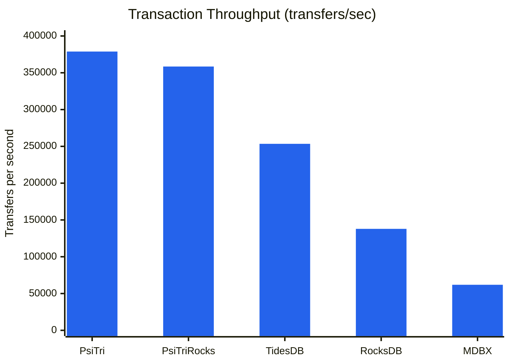
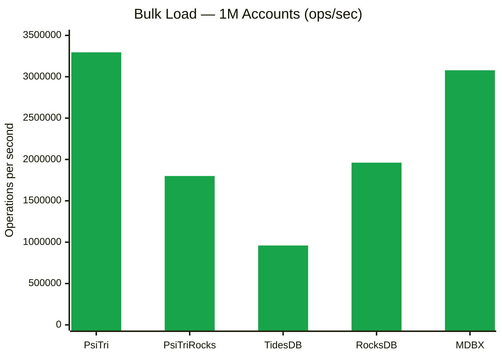
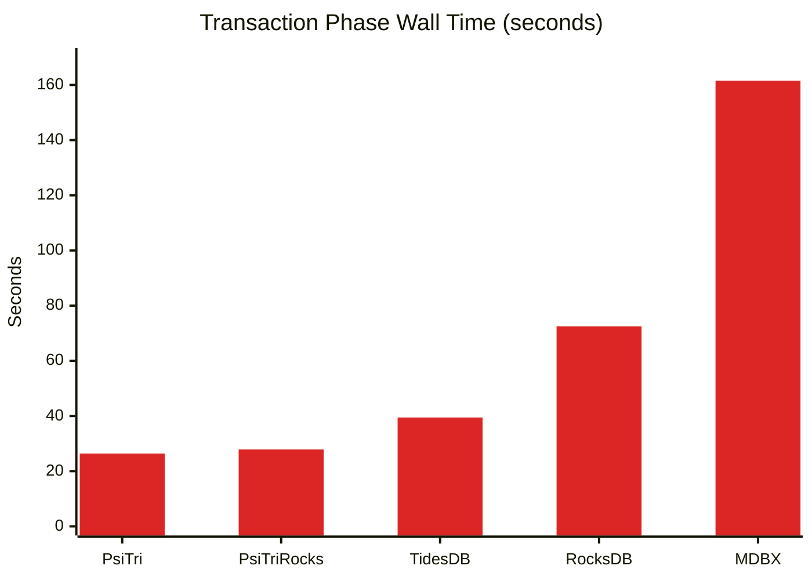
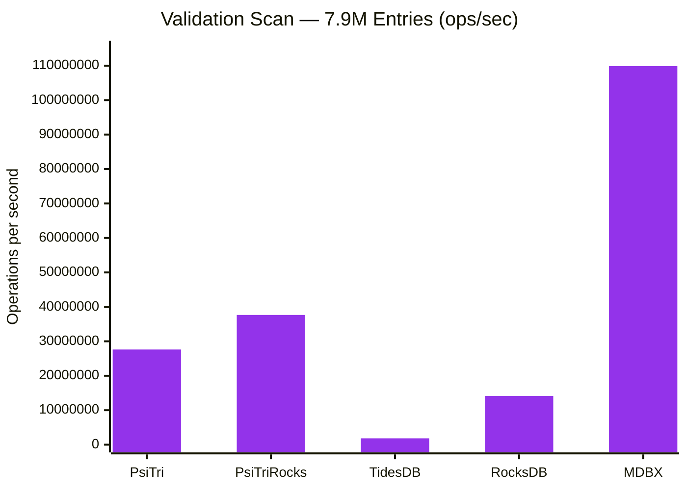
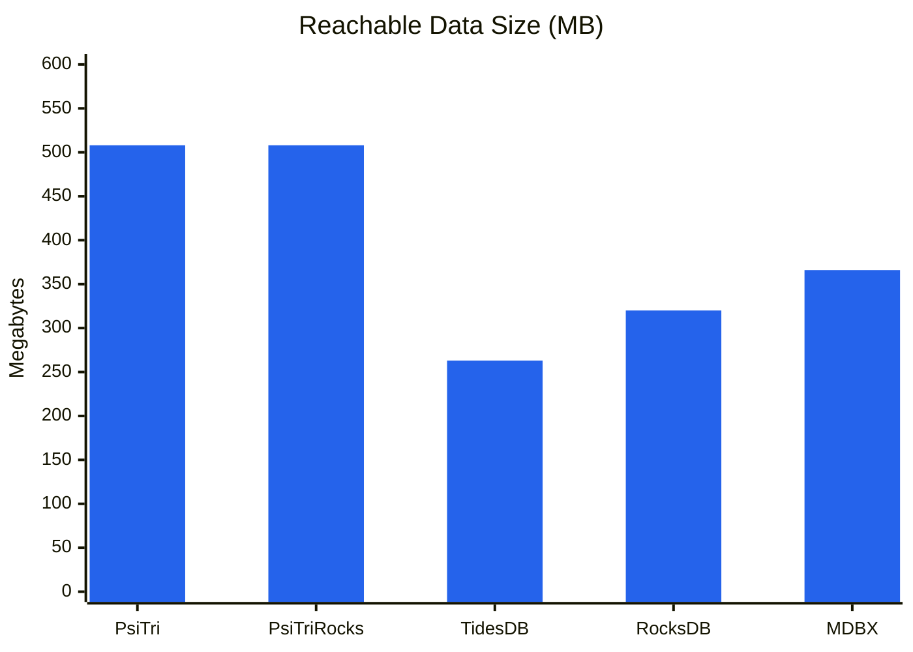
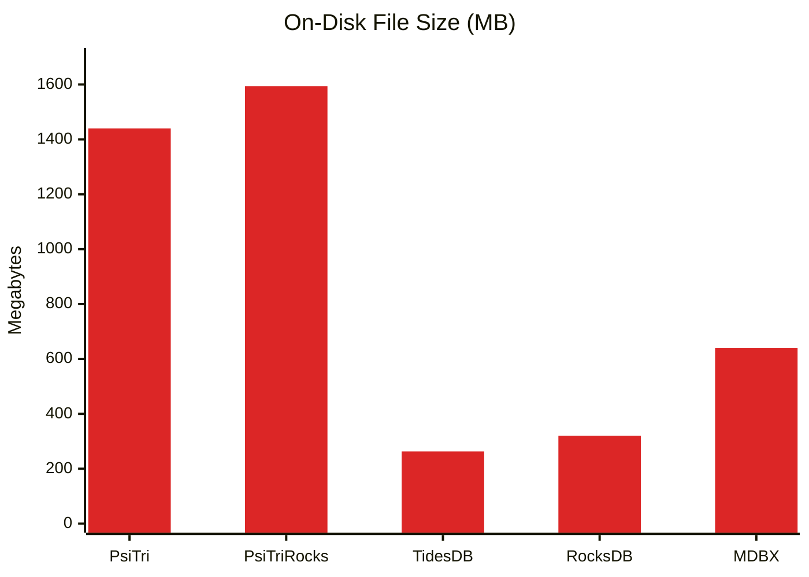

# Bank Transaction Benchmark

A realistic banking workload benchmark comparing five embedded key-value storage
engines on atomic transactional operations modeled after TPC-B.

## Workload

Each successful transfer performs **5 key-value operations** in a single atomic transaction:

1. **Read** source account balance
2. **Read** destination account balance
3. **Update** source balance (debit)
4. **Update** destination balance (credit)
5. **Insert** transaction log entry (big-endian sequence number key with transfer details)

This mirrors the TPC-B debit-credit pattern (3 updates + 1 select + 1 insert) and
exercises both random-access updates and sequential-key inserts within the same transaction.

- **1,000,000 accounts** with random names (dictionary words + synthetic binary/decimal keys)
- **10,000,000 transfer attempts** (6,856,951 successful, 3,143,049 skipped for insufficient balance)
- **Triangular access distribution** — some accounts are "hot," mimicking real-world Pareto-like skew
- **Deterministic** — identical RNG seed ensures every engine processes the exact same workload
- **Validated** — balance conservation and transaction log entry count verified after completion

### Fairness Controls

All engines use identical batching and sync parameters to ensure apples-to-apples comparison:

| Parameter | Value |
|-----------|-------|
| Batch size | 100 transfers per commit |
| Sync frequency | Every 100 commits |
| Sync mode | none (no forced durability) |
| Initial balance | 1,000,000 per account |
| RNG seed | 12345 |

## Results

### Transaction Throughput

The core metric — sustained transfers per second over 10M operations. Each successful
transfer performs 2 reads + 2 updates + 1 insert, stressing both random-access
latency and sequential-key insertion.



| Engine | Transfers/sec | Relative |
|--------|--------------|----------|
| **PsiTri** | **378,849** | **1.00x** |
| PsiTriRocks | 358,499 | 0.95x |
| TidesDB | 253,449 | 0.67x |
| RocksDB | 137,906 | 0.36x |
| MDBX | 61,902 | 0.16x |

PsiTri's adaptive radix trie uses **memory-mapped copy-on-write nodes** with an arena
allocator. A transfer touches a small number of trie nodes already in the page cache.
There is no write-ahead log, no compaction, and no memtable flush — writes go directly
to the memory-mapped data structure. Batching 100 transfers per commit amortizes the
cost of the COW root update. The RocksDB compatibility shim (PsiTriRocks) adds only
~5% overhead, confirming the shim layer is thin.

TidesDB's skip-list + SSTable architecture delivers 253K tx/sec — faster than both
RocksDB and MDBX — thanks to efficient in-memory buffering with hash-accelerated
read-your-own-writes within transactions.

RocksDB's LSM-tree must potentially check the memtable, immutable memtables, and
multiple SSTable levels on each read. The `WriteBatch` + `Get` pattern requires an
in-memory pending-write cache to support read-your-own-writes within each batch,
adding overhead per transfer.

MDBX uses a B+tree with MVCC copy-on-write. With `SAFE_NOSYNC` mode, the garbage
collector **cannot reclaim freed pages until the steady meta page advances via fsync**.
Dead COW pages accumulate between syncs (274 MB free out of 640 MB), growing the
working set beyond CPU cache. The transaction log inserts hit MDBX hardest because
each new sorted key forces B+tree page splits under COW.

### Bulk Load

Inserting 1M accounts with initial balances in a single batch transaction (or chunked
for engines with transaction size limits). This measures sequential write throughput
with no read contention.



| Engine | Time | Ops/sec |
|--------|------|---------|
| **PsiTri** | 0.30s | **3.29M** |
| MDBX | 0.33s | 3.08M |
| RocksDB | 0.51s | 1.96M |
| PsiTriRocks | 0.56s | 1.80M |
| TidesDB | 1.04s | 0.96M |

PsiTri leads bulk load at 3.29M ops/sec, benefiting from its arena allocator writing
sequentially into memory-mapped segments with no WAL or memtable overhead. MDBX's
B+tree is close behind at 3.08M ops/sec — its sorted insertion with contiguous leaf
pages is highly efficient. RocksDB's memtable absorbs writes quickly with WAL buffering.

TidesDB is slowest because its 100K operation transaction limit forces 12 separate
commit cycles, each flushing the write-ahead log.

### Transaction Time

Wall-clock time for the 10M transfer phase — the inverse of throughput, but
visualized to emphasize the absolute time cost difference between engines.



| Engine | Time | vs. PsiTri |
|--------|------|-----------|
| **PsiTri** | **26.4s** | — |
| PsiTriRocks | 27.9s | +5.7% |
| TidesDB | 39.5s | +50% |
| RocksDB | 72.5s | +175% |
| MDBX | 161.5s | +512% |

The gap between PsiTri and MDBX is over 135 seconds on the same workload. For
applications running millions of transactions per hour (financial systems,
blockchain state, game servers), this translates directly into throughput
capacity. PsiTri completes the same work in one-sixth the time MDBX requires.

### Validation Scan

A full scan reading all 1M account balances plus ~6.9M transaction log entries,
verifying balance conservation and log entry counts. This measures sequential read
throughput across the entire dataset.



| Engine | Time | Ops/sec |
|--------|------|---------|
| **MDBX** | 0.072s | **109.9M** |
| PsiTriRocks | 0.209s | 37.6M |
| PsiTri | 0.284s | 27.6M |
| RocksDB | 0.555s | 14.2M |
| TidesDB | 4.263s | 1.84M |

MDBX dominates sequential scanning at 109.9M ops/sec — its B+tree stores keys
in sorted order with contiguous leaf pages, enabling pure sequential memory
access with excellent prefetch behavior. This is MDBX's architectural sweet
spot: the same structure that penalizes random writes rewards sequential reads.

PsiTri achieves 27.6M ops/sec via cursor-based trie traversal. While tries
don't store keys contiguously, PsiTri's memory-mapped nodes and arena layout
provide reasonable locality. PsiTriRocks is faster here (37.6M) likely due to
iterator implementation differences in the shim layer.

RocksDB must merge results across multiple SSTable levels during iteration,
which explains the 14.2M ops/sec — still fast, but the merge overhead across
the now-larger dataset (accounts + log entries) is measurable.

TidesDB's scan is **60x slower** than MDBX because its C API iterator does not
expose key/value accessors, forcing the benchmark to fall back to individual
point lookups on all known account names plus sequential log key probes. This
is an API limitation, not necessarily a reflection of TidesDB's underlying
scan capability.

### Storage Efficiency

On-disk footprint after completing all 10M transfers with ~6.9M transaction log
entries. Storage efficiency reflects each engine's data structure overhead,
compression strategy, and garbage collection behavior.

#### Reachable Data Size

The most meaningful storage comparison: bytes occupied by live, reachable objects.
PsiTri now reports this by walking the trie from its roots and summing the size
of every reachable node. This eliminates dead COW copies and allocator free space
from the measurement.



The theoretical minimum raw data size is **275 MB** — the sum of all key bytes and
value bytes with zero structural overhead. This baseline is identical for all engines:
1M account keys (~8.4 MB) + 1M balances (8 MB) + 6.9M log keys (72 MB) +
6.9M log values (~187 MB).

| Engine | Reachable Data | vs. Theoretical (275 MB) | File Size | Notes |
|--------|---------------|--------------------------|-----------|-------|
| **TidesDB** | 263 MB | 0.96x | 263 MB | Likely compressed below raw size |
| **RocksDB** | 314 MB | 1.14x | 320 MB | Block compression offsets index overhead |
| **MDBX** | 366 MB | 1.33x | 640 MB | B+tree page overhead |
| **PsiTri** | 508 MB | 1.85x | 1,440 MB | Fixed 2 KB leaf allocation (see below) |
| **PsiTriRocks** | 508 MB | 1.85x | 1,594 MB | Same engine, same footprint |

PsiTri's 1.85x overhead relative to the theoretical minimum is primarily due to
fixed-size leaf node allocation: every leaf is allocated at 2,048 bytes regardless
of content. A leaf holding a single 8-byte key + 8-byte value wastes ~2,000 bytes.
Implementing graduated leaf sizing (e.g. 128 → 256 → 512 → 1024 → 2048) would
bring PsiTri's reachable data much closer to the theoretical minimum.

RocksDB and TidesDB achieve near-theoretical or below-theoretical sizes through
block compression, which is particularly effective on the sequential log keys and
small fixed-size values in this workload.

#### File Size

The raw on-disk file size includes dead COW copies and allocator free space that
has not yet been reclaimed. PsiTri's background compactor continuously reclaims
dead space during the benchmark, keeping the file size within ~3x of reachable data.



| Engine | File Size | Reachable | Dead/Free Space | Notes |
|--------|-----------|-----------|-----------------|-------|
| **PsiTri** | 1,440 MB | 508 MB | 932 MB (65%) | COW copies + allocator free space |
| **PsiTriRocks** | 1,594 MB | 508 MB | 1,086 MB (68%) | Same engine via RocksDB API shim |
| **MDBX** | 640 MB | 366 MB | 274 MB (43%) | COW pages accumulate between syncs |
| **RocksDB** | 320 MB | 314 MB | 6 MB (2%) | LSM compaction + block compression |
| **TidesDB** | 263 MB | 263 MB | 0 MB | No detailed stats exposed |

RocksDB achieves the most compact footprint thanks to LSM compaction and block
compression. The transaction log entries (sequential keys with ~30-byte values)
compress well under RocksDB's block-based scheme.

MDBX's 640 MB file is 43% free space — dead COW pages that the GC cannot reclaim
without an fsync. The transaction log inserts grow the B+tree significantly because
each new sequential key requires page allocation under COW.

PsiTri's file size is 2.8x its reachable data. The dead space consists of COW copies
awaiting compaction and allocator free space within segments. The background compactor
reclaims segments as they accumulate dead objects, keeping growth bounded during
sustained write workloads. The reachable data measurement confirms the trie structure
itself is space-competitive — the overhead is from in-flight garbage collection, not
data structure inefficiency.

### Summary

| Engine | Architecture | Strength | Weakness |
|--------|-------------|----------|----------|
| **PsiTri** | Adaptive radix trie, mmap COW | Fastest transactions (379K/s) | Larger file footprint (COW + compaction) |
| **PsiTriRocks** | PsiTri via RocksDB API shim | Drop-in RocksDB replacement | Slight shim overhead |
| **TidesDB** | Skip-list + SSTables | Good tx speed (253K/s), compact | Slow scan, 100K txn op limit |
| **RocksDB** | LSM-tree | Compact storage (320 MB) | 2.7x slower than PsiTri |
| **MDBX** | B+tree, MVCC COW | Fastest sequential scan (110M/s) | 6.1x slower transactions |

All five engines pass validation: balance conservation verified (1,000,000,000,000
total) and transaction log entry counts match (6,856,951). Each engine processes
the same deterministic workload with identical success/skip counts.

## Reproducing

```bash
# Build all engines (from repo root)
cmake -G Ninja -DCMAKE_BUILD_TYPE=Release \
      -DBUILD_ROCKSDB_BENCH=ON \
      -DBUILD_TIDESDB_BENCH=ON \
      -B build/release

cmake --build build/release -j$(nproc) --target \
      bank-bench-psitri \
      bank-bench-psitrirocks \
      bank-bench-rocksdb \
      bank-bench-mdbx \
      bank-bench-tidesdb

# Run each engine with identical parameters
for engine in psitri psitrirocks rocksdb mdbx tidesdb; do
    build/release/bin/bank-bench-${engine} \
        --num-accounts=1000000 \
        --num-transactions=10000000 \
        --batch-size=100 \
        --sync-every=100 \
        --db-path=/tmp/bb_${engine}
done
```

### CLI Options

| Flag | Default | Description |
|------|---------|-------------|
| `--num-accounts` | 1,000,000 | Number of bank accounts |
| `--num-transactions` | 10,000,000 | Number of transfer attempts |
| `--batch-size` | 1 | Transfers per commit |
| `--sync-every` | 0 | Sync to disk every N commits (0 = never) |
| `--sync-mode` | none | Durability: `none`, `async`, `sync` |
| `--seed` | 12345 | RNG seed for reproducibility |
| `--db-path` | /tmp/bank_bench_db | Database directory |
| `--initial-balance` | 1,000,000 | Starting balance per account |

## Environment

- **Hardware**: Apple M5 Max (ARM64)
- **OS**: macOS (Darwin 25.3.0)
- **Compiler**: Clang 17 (LLVM), C++20, `-O3 -flto=thin`
- **Engine versions**: RocksDB 9.9.3, libmdbx 0.13.11, TidesDB 8.9.4
