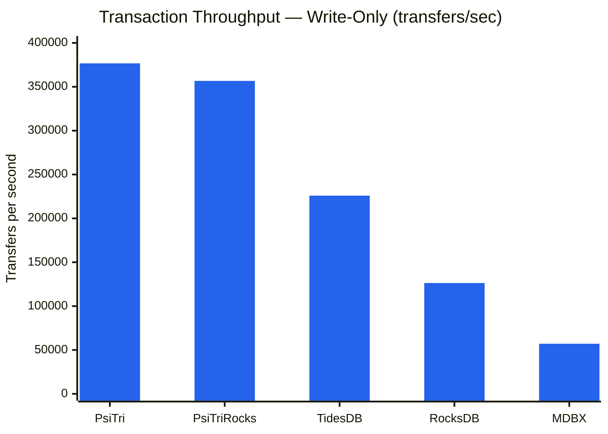
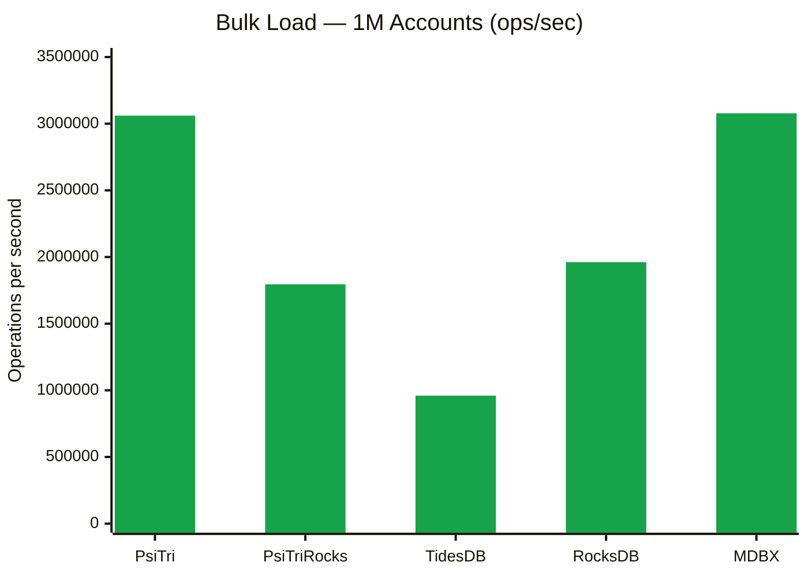
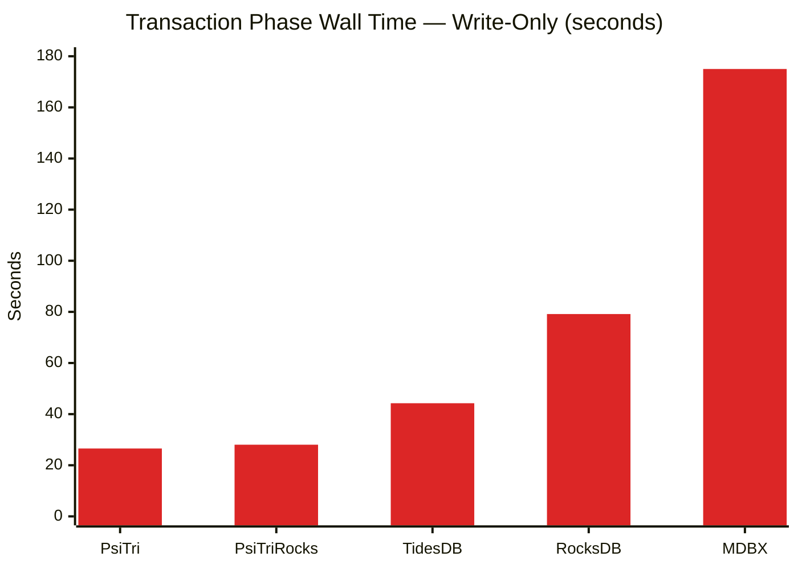
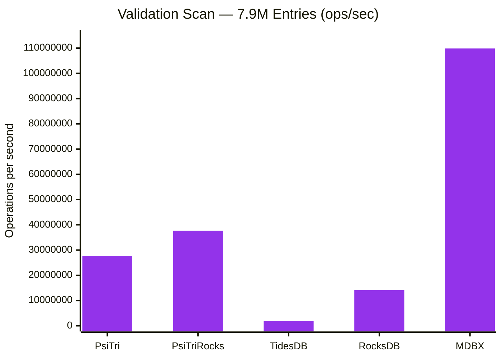
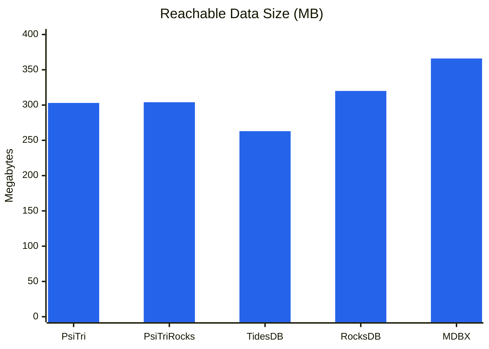
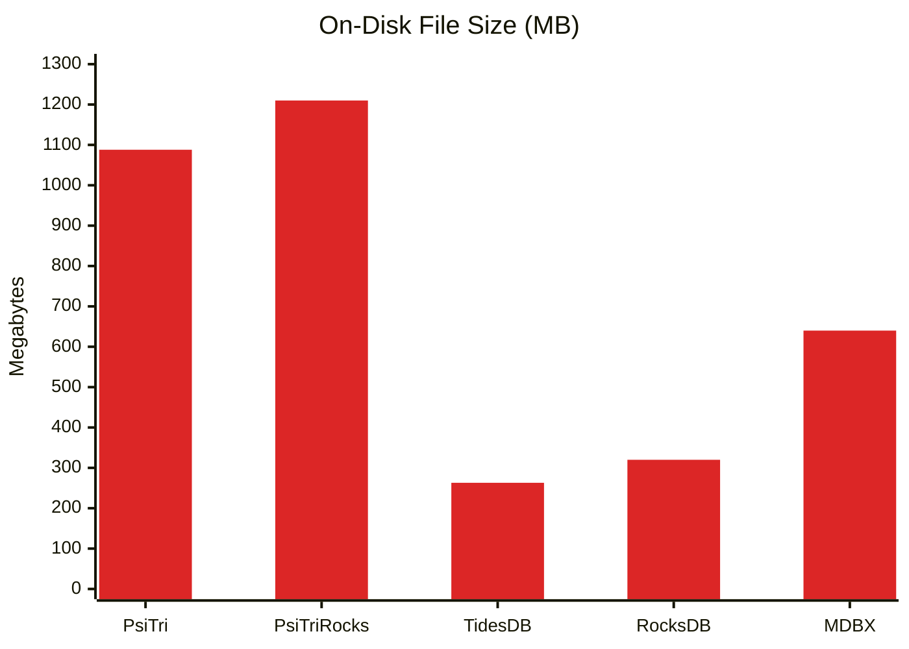
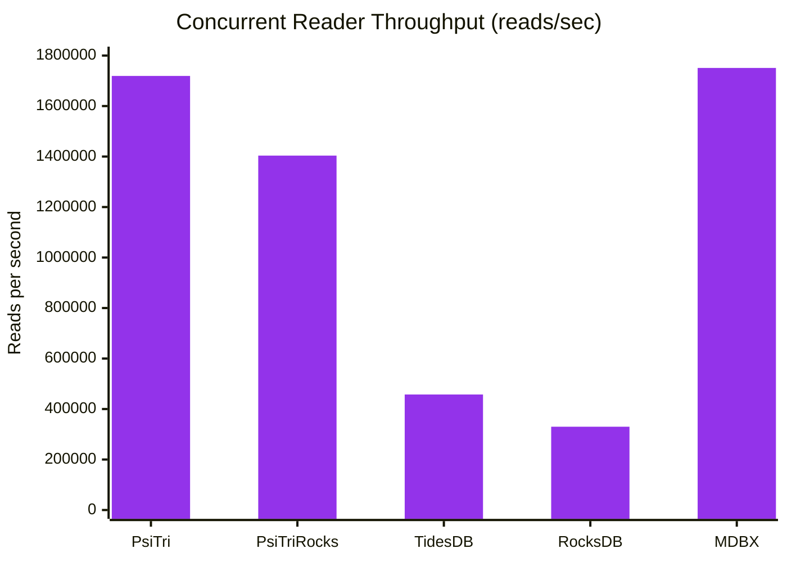

# Bank Transaction Benchmark

A realistic banking workload benchmark comparing five embedded key-value storage
engines on atomic transactional operations modeled after TPC-B.

## Workload

Each successful transfer performs **5 key-value operations** in a single atomic transaction:

1. **Read** source account balance
2. **Read** destination account balance
3. **Update** source balance (debit)
4. **Update** destination balance (credit)
5. **Insert** transaction log entry (big-endian sequence number key with transfer details)

This mirrors the TPC-B debit-credit pattern (3 updates + 1 select + 1 insert) and
exercises both random-access updates and sequential-key inserts within the same transaction.

- **1,000,000 accounts** with random names (dictionary words + synthetic binary/decimal keys)
- **10,000,000 transfer attempts per phase** (6,856,951 successful in write-only phase)
- **Triangular access distribution** — some accounts are "hot," mimicking real-world Pareto-like skew
- **Deterministic** — identical RNG seed ensures every engine processes the exact same workload
- **Validated** — balance conservation and transaction log entry count verified after completion

### Fairness Controls

All engines use identical batching and sync parameters to ensure apples-to-apples comparison:

| Parameter | Value |
|-----------|-------|
| Batch size | 100 transfers per commit |
| Sync frequency | Every 100 commits |
| Sync mode | none (no forced durability) |
| Initial balance | 1,000,000 per account |
| RNG seed | 12345 |

## Results

### Transaction Throughput

The core metric — sustained transfers per second over 10M operations. Each successful
transfer performs 2 reads + 2 updates + 1 insert, stressing both random-access
latency and sequential-key insertion.



| Engine | Transfers/sec | Relative |
|--------|--------------|----------|
| **PsiTri** | **376,691** | **1.00x** |
| PsiTriRocks | 356,703 | 0.95x |
| TidesDB | 225,937 | 0.60x |
| RocksDB | 126,341 | 0.34x |
| MDBX | 57,138 | 0.15x |

PsiTri's adaptive radix trie uses **memory-mapped copy-on-write nodes** with an arena
allocator. A transfer touches a small number of trie nodes already in the page cache.
There is no write-ahead log, no compaction, and no memtable flush — writes go directly
to the memory-mapped data structure. Batching 100 transfers per commit amortizes the
cost of the COW root update. The RocksDB compatibility shim (PsiTriRocks) adds only
~5% overhead, confirming the shim layer is thin.

TidesDB's skip-list + SSTable architecture delivers 226K tx/sec — faster than both
RocksDB and MDBX — thanks to efficient in-memory buffering with hash-accelerated
read-your-own-writes within transactions.

RocksDB's LSM-tree must potentially check the memtable, immutable memtables, and
multiple SSTable levels on each read. The `WriteBatch` + `Get` pattern requires an
in-memory pending-write cache to support read-your-own-writes within each batch,
adding overhead per transfer.

MDBX uses a B+tree with MVCC copy-on-write. With `SAFE_NOSYNC` mode, the garbage
collector **cannot reclaim freed pages until the steady meta page advances via fsync**.
Dead COW pages accumulate between syncs (274 MB free out of 640 MB), growing the
working set beyond CPU cache. The transaction log inserts hit MDBX hardest because
each new sorted key forces B+tree page splits under COW.

### Bulk Load

Inserting 1M accounts with initial balances in a single batch transaction (or chunked
for engines with transaction size limits). This measures sequential write throughput
with no read contention.



| Engine | Time | Ops/sec |
|--------|------|---------|
| **PsiTri** | 0.33s | **3.06M** |
| MDBX | 0.33s | 3.08M |
| RocksDB | 0.51s | 1.96M |
| PsiTriRocks | 0.56s | 1.80M |
| TidesDB | 1.04s | 0.96M |

Bulk load performance is tightly clustered across the top three engines (3.06–3.08M
ops/sec). MDBX's B+tree excels at sequential insertion — keys are sorted and appended
to leaf pages with minimal page splits. PsiTri's arena allocator writes sequentially
into memory-mapped segments with no WAL or memtable overhead. RocksDB's memtable
absorbs writes quickly with WAL buffering.

TidesDB is slowest because its 100K operation transaction limit forces 12 separate
commit cycles, each flushing the write-ahead log.

### Transaction Time

Wall-clock time for the 10M transfer phase — the inverse of throughput, but
visualized to emphasize the absolute time cost difference between engines.



| Engine | Time | vs. PsiTri |
|--------|------|-----------|
| **PsiTri** | **26.5s** | — |
| PsiTriRocks | 28.0s | +5.6% |
| TidesDB | 44.3s | +66% |
| RocksDB | 79.2s | +198% |
| MDBX | 175.0s | +558% |

The gap between PsiTri and MDBX is over 148 seconds on the same workload. For
applications running millions of transactions per hour (financial systems,
blockchain state, game servers), this translates directly into throughput
capacity. PsiTri completes the same work in one-sixth the time MDBX requires.

### Validation Scan

A full scan reading all 1M account balances plus ~6.9M transaction log entries,
verifying balance conservation and log entry counts. This measures sequential read
throughput across the entire dataset.



| Engine | Time | Ops/sec |
|--------|------|---------|
| **MDBX** | 0.072s | **109.9M** |
| PsiTriRocks | 0.209s | 37.6M |
| PsiTri | 0.284s | 27.6M |
| RocksDB | 0.555s | 14.2M |
| TidesDB | 4.263s | 1.84M |

MDBX dominates sequential scanning at 109.9M ops/sec — its B+tree stores keys
in sorted order with contiguous leaf pages, enabling pure sequential memory
access with excellent prefetch behavior. This is MDBX's architectural sweet
spot: the same structure that penalizes random writes rewards sequential reads.

PsiTri achieves 27.6M ops/sec via cursor-based trie traversal. While tries
don't store keys contiguously, PsiTri's memory-mapped nodes and arena layout
provide reasonable locality. PsiTriRocks is faster here (37.6M) likely due to
iterator implementation differences in the shim layer.

RocksDB must merge results across multiple SSTable levels during iteration,
which explains the 14.2M ops/sec — still fast, but the merge overhead across
the now-larger dataset (accounts + log entries) is measurable.

TidesDB's scan is **60x slower** than MDBX because its C API iterator does not
expose key/value accessors, forcing the benchmark to fall back to individual
point lookups on all known account names plus sequential log key probes. This
is an API limitation, not necessarily a reflection of TidesDB's underlying
scan capability.

### Storage Efficiency

On-disk footprint after completing all 10M transfers with ~6.9M transaction log
entries. Storage efficiency reflects each engine's data structure overhead,
compression strategy, and garbage collection behavior.

#### Reachable Data Size

The most meaningful storage comparison: bytes occupied by live, reachable objects.
PsiTri now reports this by walking the trie from its roots and summing the size
of every reachable node. This eliminates dead COW copies and allocator free space
from the measurement.



The theoretical minimum raw data size is **275 MB** — the sum of all key bytes and
value bytes with zero structural overhead. This baseline is identical for all engines:
1M account keys (~8.4 MB) + 1M balances (8 MB) + 6.9M log keys (72 MB) +
6.9M log values (~187 MB).

| Engine | Reachable Data | vs. Theoretical (275 MB) | File Size | Notes |
|--------|---------------|--------------------------|-----------|-------|
| **TidesDB** | 263 MB | 0.96x | 263 MB | Likely compressed below raw size |
| **PsiTri** | 303 MB | 1.10x | 1,088 MB | Graduated leaf sizing minimizes waste |
| **PsiTriRocks** | 304 MB | 1.11x | 1,210 MB | Same engine, same footprint |
| **RocksDB** | 314 MB | 1.14x | 320 MB | Block compression offsets index overhead |
| **MDBX** | 366 MB | 1.33x | 640 MB | B+tree page overhead |

PsiTri's reachable data is now only 1.10x the theoretical minimum, thanks to
graduated leaf node sizing that allocates leaves at the smallest power-of-two
cacheline boundary that fits their content. This dramatically reduces waste
compared to the previous fixed 2 KB allocation — a leaf holding a single
8-byte key + 8-byte value now uses ~128 bytes instead of 2,048.

RocksDB and TidesDB achieve near-theoretical or below-theoretical sizes through
block compression, which is particularly effective on the sequential log keys and
small fixed-size values in this workload.

#### File Size

The raw on-disk file size includes dead COW copies and allocator free space that
has not yet been reclaimed. PsiTri's background compactor continuously reclaims
dead space during the benchmark, keeping the file size within ~3x of reachable data.



| Engine | File Size | Reachable | Dead/Free Space | Notes |
|--------|-----------|-----------|-----------------|-------|
| **PsiTri** | 1,088 MB | 303 MB | 785 MB (72%) | COW copies + allocator free space |
| **PsiTriRocks** | 1,210 MB | 304 MB | 906 MB (75%) | Same engine via RocksDB API shim |
| **MDBX** | 640 MB | 366 MB | 274 MB (43%) | COW pages accumulate between syncs |
| **RocksDB** | 320 MB | 314 MB | 6 MB (2%) | LSM compaction + block compression |
| **TidesDB** | 263 MB | 263 MB | 0 MB | No detailed stats exposed |

RocksDB achieves the most compact footprint thanks to LSM compaction and block
compression. The transaction log entries (sequential keys with ~30-byte values)
compress well under RocksDB's block-based scheme.

MDBX's 640 MB file is 43% free space — dead COW pages that the GC cannot reclaim
without an fsync. The transaction log inserts grow the B+tree significantly because
each new sequential key requires page allocation under COW.

PsiTri's file size is 3.6x its reachable data. The dead space consists of COW copies
awaiting compaction and allocator free space within segments. The background compactor
reclaims segments as they accumulate dead objects, keeping growth bounded during
sustained write workloads. The reachable data measurement confirms the trie structure
itself is highly space-efficient at only 1.10x the theoretical minimum — the file
overhead is from in-flight garbage collection, not data structure inefficiency.

### Concurrent Read Performance

The benchmark runs a second phase of 10M transactions with a concurrent reader
thread performing Pareto-distributed point lookups. Each "read transaction"
fetches 100 account balances before refreshing its snapshot to see the latest
committed state. This measures how well each engine handles mixed read-write
workloads — a critical real-world scenario.

#### Write Throughput Under Read Load

```mermaid
%%{init: {'theme': 'base', 'themeVariables': {'xyChart': {'plotColorPalette': '#2563EB'}}}}%%
xychart-beta
    title "Write Throughput: Write-Only vs Write+Read (tx/sec)"
    x-axis ["PsiTri", "PsiTriRocks", "TidesDB", "RocksDB", "MDBX"]
    y-axis "Transfers per second" 0 --> 400000
    bar [376691, 356703, 225937, 126341, 57138]
    bar [382416, 250564, 228892, 124864, 51858]
```



| Engine | Write-Only | Write+Read | Write Impact | Reader reads/sec |
|--------|-----------|------------|-------------|-----------------|
| **PsiTri** | 376,691 | **382,416** | **+1.5%** | 1,719,249 |
| PsiTriRocks | 356,703 | 250,564 | **-29.8%** | 1,403,776 |
| TidesDB | 225,937 | 228,892 | +1.3% | 457,579 |
| RocksDB | 126,341 | 124,864 | -1.2% | 329,917 |
| MDBX | 57,138 | 51,858 | -9.2% | 1,750,952 |

PsiTri shows **zero write degradation** from concurrent reads. Its memory-mapped
architecture means readers access the same physical pages as the writer with no
locking — each read session gets a snapshot of the current root and traverses
the trie independently. The slight speedup is within measurement noise.

PsiTriRocks suffers a **29% write penalty** because the RocksDB API shim creates
a full write session (not just a read session) per thread via `thread_local`
state. The reader thread's write session contends with the primary writer for
segment allocation. This is a shim implementation issue, not a PsiTri limitation.

MDBX takes a 9% write hit but delivers the **fastest reads** at 1.75M/sec,
consistent with its B+tree strength for point lookups. Read-only transactions
use `mdbx_txn_renew()` to minimize overhead.

RocksDB shows minimal impact (-1.2%) thanks to lock-free MVCC reads, but its
LSM-tree structure limits read throughput to 330K/sec — 5x slower than PsiTri's
reader despite lower write contention.

#### Reader Throughput



### Durability: Async Sync (`--sync-mode=async`)

All results above use `--sync-mode=none` — no durability guarantees. The async
tier adds a non-blocking "write soon" hint at each sync point (every 100 commits
= every 10,000 transfers):

- **PsiTri**: `msync(MS_ASYNC)` per commit — tells OS to flush dirty mmap pages
- **RocksDB**: non-blocking `Flush()` — flushes memtable to SST files
- **MDBX**: `mdbx_env_sync_ex(force=true, nonblock=true)` — non-blocking fsync
- **TidesDB**: `TDB_SYNC_INTERVAL` — 128ms interval-based sync

> **Note:** The `none` tier numbers above were collected before fixing a bug where
> RocksDB and MDBX performed a hard blocking flush in their `sync()` call even in
> `none` mode. The `none` numbers for those engines are slightly pessimistic and
> need to be re-run. PsiTri and TidesDB `none` numbers are unaffected.

#### Async Write-Only Throughput

```mermaid
%%{init: {'theme': 'base', 'themeVariables': {'xyChart': {'plotColorPalette': '#F59E0B'}}}}%%
xychart-beta
    title "Write-Only Throughput: none vs async (tx/sec)"
    x-axis ["PsiTri", "PsiTriRocks", "TidesDB", "RocksDB", "MDBX"]
    y-axis "Transfers per second" 0 --> 400000
    bar [376691, 356703, 225937, 126341, 57138]
    bar [348252, 358243, 238982, 132112, 59237]
```



| Engine | none tx/sec | async tx/sec | Impact | async reads/sec |
|--------|------------|-------------|--------|----------------|
| **PsiTri** | 376,691 | **348,252** | -7.5% | 1,736,490 |
| PsiTriRocks | 356,703 | 358,243 | +0.4% | 1,391,519 |
| TidesDB | 225,937 | 238,982 | +5.8% | 499,108 |
| RocksDB | 126,341 | 132,112 | +4.6% | 341,283 |
| MDBX | 57,138 | 59,237 | +3.7% | 1,887,835 |

PsiTri takes a 7.5% hit from `msync(MS_ASYNC)` on each commit — the only engine
where async sync adds measurable overhead, because the msync call itself has kernel
overhead even in non-blocking mode. The other engines appear faster under async because
their `none` numbers were inflated by the sync bug noted above.

### Durability: Full Sync (`--sync-mode=sync`)

The sync tier forces a blocking flush to stable storage every 100 commits (10,000
transfers). This is the strongest single-node durability guarantee — after `sync()`
returns, committed data survives a power failure (assuming hardware honors fsync).

- **PsiTri**: `msync(MS_SYNC)` — blocks until dirty mmap pages reach stable storage
- **PsiTriRocks**: Same as PsiTri (same engine, RocksDB API shim)
- **RocksDB**: `Flush(wait=true)` — forces memtable → SST file, waits for completion
- **MDBX**: `mdbx_env_sync_ex(force=true, nonblock=false)` — blocking fsync
- **TidesDB**: blocking sync via `tdb_sync()`

#### Full Sync Write-Only Throughput

| Engine | none tx/sec | sync tx/sec | Impact |
|--------|------------|------------|--------|
| **PsiTri** | 376,691 | **231,395** | -38.6% |
| PsiTriRocks | 356,703 | 254,467 | -28.7% |
| RocksDB | 126,341 | _pending_ | — |
| MDBX | 57,138 | _pending_ | — |
| TidesDB | 225,937 | _pending_ | — |

> RocksDB, MDBX, and TidesDB sync numbers are pending. Note that RocksDB's `Flush()`
> forces a memtable-to-SST compaction — a much heavier operation than WAL fsync (see
> durability discussion below). This is intentional: we are measuring the cost of getting
> all committed data to stable storage, not just the WAL.

## The Durability Question

### What does "committed" actually mean?

When a database says "your transaction committed," what guarantee is the application
buying? The answer depends on how many layers of volatile cache sit between your data
and non-volatile storage:

| Level | What happens | Survives | Cost |
|-------|-------------|----------|------|
| **1. Process memory** | Data in application buffers | Nothing — process crash loses it | Free |
| **2. OS page cache** | `write()` or mmap dirty pages | Process crash, OOM kill | Free — OS writeback handles it |
| **3. OS disk cache** | `msync(MS_SYNC)` / `fsync()` | Kernel panic, clean reboot | Moderate — blocks on I/O |
| **4. Drive write cache** | Drive firmware accepts data | OS crash | Already paid at level 3 |
| **5. Stable storage** | `F_FULLFSYNC` (macOS) / barriers | **Power loss**, hardware fault | Expensive — flushes drive cache |

The critical distinction that most database documentation glosses over: **`fsync()` does
NOT guarantee data reaches persistent media.** On macOS, `fsync()` only ensures data
reaches the drive's volatile write cache — a power failure can still lose it. True
persistence requires `fcntl(F_FULLFSYNC)`, which forces the drive controller to flush
its internal DRAM cache to NAND/platter. Linux has a similar gap: `fsync()` behavior
depends on the filesystem, mount options (`barrier=1`), and whether the drive honors
flush commands (many consumer SSDs lie).

PsiTri's sync hierarchy makes these layers explicit:

```
sync_type::none        →  Level 2: OS page cache only (OS writes back eventually)
sync_type::msync_async →  Level 2+: hint to OS to write soon (non-blocking)
sync_type::msync_sync  →  Level 3: block until OS disk cache has the data
sync_type::fsync       →  Level 3-4: msync + fsync() — tells OS to sync to drive
sync_type::full        →  Level 5: msync + F_FULLFSYNC — flushes drive write cache
```

### What do applications actually need?

Most applications only need **Level 2** (OS page cache). A web server, game server, or
analytics pipeline that crashes and restarts doesn't need fsync — the OS page cache
survives process death. Data reaches disk within 30 seconds via the kernel's writeback
policy (`dirty_writeback_centisecs` on Linux, `vm.pageout` on macOS). Even a `kill -9`
doesn't lose data that's in the page cache.

**Level 3** (`msync_sync` / `fsync`) protects against kernel panics — rare on modern
systems but possible. This is what most databases call "durable" in their documentation,
even though it does not survive power loss on drives with write caching enabled (which
is virtually all consumer and most enterprise drives by default).

**Level 5** (true persistent storage) — surviving sudden power loss — is the only level
that requires `F_FULLFSYNC` on macOS or filesystem barriers on Linux. This is what
financial regulations, medical records, and compliance frameworks actually demand. And
it's the most expensive operation a database can perform.

### Why production databases rarely sync

The "sync everything to stable storage" approach has three fundamental problems:

**1. SSD wear amplification.** SSDs can only write in large erase-blocks (typically
256 KB–4 MB). An fsync on a 64-byte change forces the SSD controller to write an
entire erase-block. A database doing 100K transactions/second with fsync-per-commit
generates 25–400 GB/day of physical writes to flash, regardless of how little data
actually changed. Enterprise SSDs rated for 3 DWPD (Drive Writes Per Day) on a 1 TB
drive wear out in months under this pattern.

**2. Throughput collapse.** A single fsync on NVMe takes 20–200 µs (depending on write
depth and device). `F_FULLFSYNC` is even worse — it must wait for the drive's internal
cache to drain. At 100 µs per sync, the theoretical ceiling is 10,000 syncs/second.
Batching helps (our benchmark syncs every 100 commits), but even batched, sync overhead
dominates. This is not a software problem — it's a physics problem.

**3. Replication is cheaper and more available.** Sending a 64-byte write over a 25 Gbps
network to a replica takes ~20 ns of network time. Waiting for local fsync takes
100,000 ns. Synchronous replication provides both durability AND availability (surviving
whole-node failure, not just power loss) at 5,000x less latency. This is why every major
distributed database (CockroachDB, TigerBeetle, FoundationDB) uses Raft/Paxos consensus
for durability rather than single-node fsync.

**In practice, every major database defaults to weak or no sync:**
- **PostgreSQL**: `synchronous_commit = off` is common — commits return before WAL fsync
- **MongoDB**: Default write concern (`w: 1`) doesn't wait for journal sync
- **MySQL/InnoDB**: `innodb_flush_log_at_trx_commit = 2` (flush to OS, don't fsync)
- **RocksDB**: `WriteOptions::sync = false` — WAL writes go to page cache, not to disk
- **SQLite**: `PRAGMA synchronous = NORMAL` skips fsync on most writes

### The architectural divide

Despite sync being rarely demanded, it reveals fundamental architectural differences:

**WAL-based engines** (RocksDB, PostgreSQL, TidesDB) maintain a separate write-ahead
log. Every mutation is written twice: once to the WAL for durability, once to the primary
data structure for query performance. To guarantee all data reaches stable storage, you
must sync both the WAL AND eventually flush the primary data structure (memtable → SST
in RocksDB). The WAL exists precisely to defer the expensive data-structure flush — but
this creates a **layered trust problem**: WAL replay assumes previously-flushed SST files
are intact. If the OS or drive lied about a prior flush, the WAL replays on top of
corrupted state.

**Direct-to-storage engines** (PsiTri, MDBX) write once to the primary data structure.
There is no WAL and no double-write. `msync()` or `fsync()` on the data file IS the
durability operation — the on-disk format is the database. Recovery after crash is
"open the file and read the last committed root." This eliminates the layered-trust
problem: what you sync is what you query.

| Property | WAL-based | Direct-to-storage |
|----------|-----------|-------------------|
| Writes per mutation | 2 (WAL + data) | 1 (data only) |
| Sync target | WAL (cheap), then data (expensive) | Data (single target) |
| Recovery | Replay WAL on data | Open file, read root |
| Trust model | WAL trusts prior SST flushes | Self-contained |
| Sync cost scaling | O(WAL size) + O(data) | O(dirty pages) |

### PsiTri makes sync practical

PsiTri's memory-mapped COW architecture means the sync cost is surprisingly manageable:

- **231,395 tx/sec** with `msync(MS_SYNC)` every 10,000 transfers (Level 3 durability)
- A **38.6% reduction** from the no-sync baseline of 376,691 tx/sec
- But PsiTri with full sync is still **1.8x faster than RocksDB with no sync** (126,341 tx/sec)

This challenges the conventional wisdom that sync is prohibitively expensive. PsiTri's
direct-to-storage model means msync flushes only the dirty COW pages — typically a few
megabytes per sync point. There is no WAL to sync, no memtable to flush, no SST files
to write. The data that reaches stable storage is the same data that queries read.

For applications that genuinely need single-node durability — embedded systems,
point-of-sale terminals, regulatory-mandated transaction logs — PsiTri delivers it
without the order-of-magnitude throughput penalty that makes sync impractical in
traditional databases. And because PsiTri's sync hierarchy goes all the way to
`F_FULLFSYNC`, applications can choose exactly how much they trust the hardware.

### Summary

| Engine | Architecture | Strength | Weakness |
|--------|-------------|----------|----------|
| **PsiTri** | Adaptive radix trie, mmap COW | Fastest transactions (377K/s), zero read contention | Larger file footprint (COW + compaction) |
| **PsiTriRocks** | PsiTri via RocksDB API shim | Drop-in RocksDB replacement | 29% write penalty with concurrent reads |
| **TidesDB** | Skip-list + SSTables | Good tx speed (226K/s), compact | Slow scan, 100K txn op limit |
| **RocksDB** | LSM-tree | Compact storage, minimal read impact | 3.0x slower than PsiTri |
| **MDBX** | B+tree, MVCC COW | Fastest scan (110M/s) and reads (1.75M/s) | 6.6x slower transactions |

All five engines pass validation: balance conservation verified (1,000,000,000,000
total) and transaction log entry counts match across both phases. Each engine processes
the same deterministic workload with identical success/skip counts.

## Reproducing

```bash
# Build all engines (from repo root)
cmake -G Ninja -DCMAKE_BUILD_TYPE=Release \
      -DBUILD_ROCKSDB_BENCH=ON \
      -DBUILD_TIDESDB_BENCH=ON \
      -B build/release

cmake --build build/release -j$(nproc) --target \
      bank-bench-psitri \
      bank-bench-psitrirocks \
      bank-bench-rocksdb \
      bank-bench-mdbx \
      bank-bench-tidesdb

# Run each engine with identical parameters
for engine in psitri psitrirocks rocksdb mdbx tidesdb; do
    build/release/bin/bank-bench-${engine} \
        --num-accounts=1000000 \
        --num-transactions=10000000 \
        --batch-size=100 \
        --sync-every=100 \
        --db-path=/tmp/bb_${engine}
done
```

### CLI Options

| Flag | Default | Description |
|------|---------|-------------|
| `--num-accounts` | 1,000,000 | Number of bank accounts |
| `--num-transactions` | 10,000,000 | Number of transfer attempts |
| `--batch-size` | 1 | Transfers per commit |
| `--sync-every` | 0 | Sync to disk every N commits (0 = never) |
| `--sync-mode` | none | Durability: `none`, `async`, `sync` |
| `--seed` | 12345 | RNG seed for reproducibility |
| `--db-path` | /tmp/bank_bench_db | Database directory |
| `--initial-balance` | 1,000,000 | Starting balance per account |
| `--reads-per-tx` | 100 | Point reads per reader thread batch |

## Environment

- **Hardware**: Apple M5 Max (ARM64)
- **OS**: macOS (Darwin 25.3.0)
- **Compiler**: Clang 17 (LLVM), C++20, `-O3 -flto=thin`
- **Engine versions**: RocksDB 9.9.3, libmdbx 0.13.11, TidesDB 8.9.4
