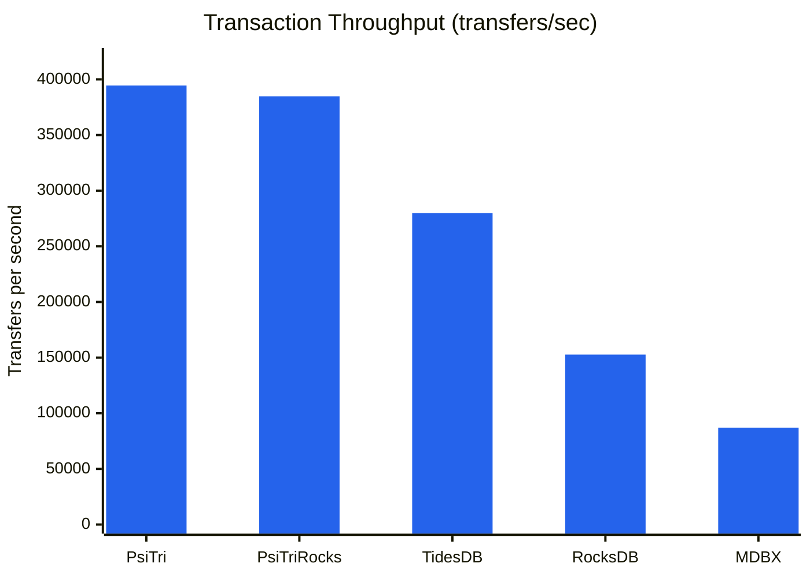
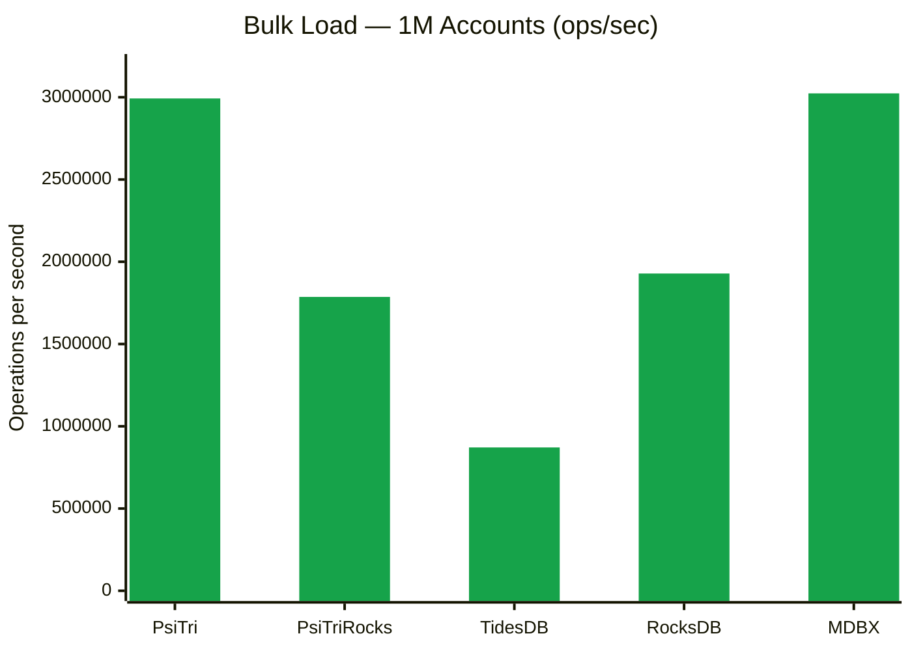
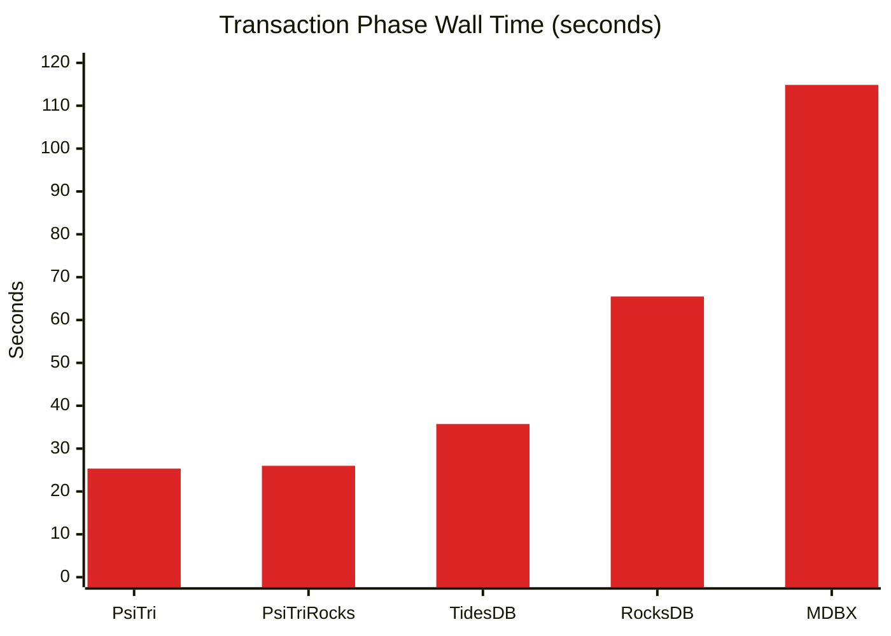
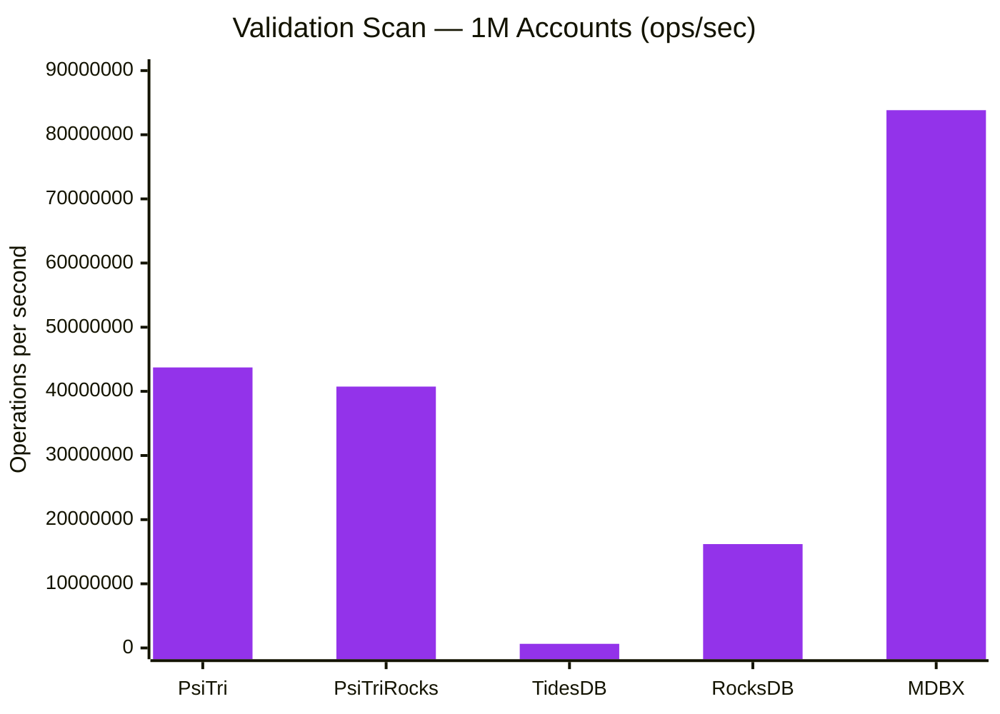
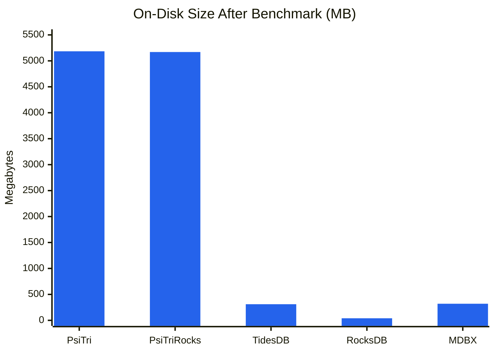

# Bank Transaction Benchmark

A realistic banking workload benchmark comparing five embedded key-value storage engines on atomic read-modify-write transactions.

## Workload

- **1,000,000 accounts** with random names (dictionary words + synthetic binary/decimal keys)
- **10,000,000 transfers** — each reads two balances, conditionally writes two updated balances
- **Triangular access distribution** — some accounts are "hot," mimicking real-world Pareto-like skew
- **~31% of transfers skip** due to insufficient balance (intentional — models realistic aborted transactions)
- **Deterministic** — identical RNG seed ensures every engine processes the exact same workload

### Fairness Controls

All engines use identical batching and sync parameters to ensure apples-to-apples comparison:

| Parameter | Value |
|-----------|-------|
| Batch size | 100 transfers per commit |
| Sync frequency | Every 100 commits |
| Sync mode | none (no forced durability) |
| Initial balance | 1,000,000 per account |
| RNG seed | 12345 |

## Results

### Transaction Throughput

The core metric — sustained transfers per second over 10M operations. Each transfer
reads two account balances, checks for sufficient funds, and writes two updated
balances — a classic read-modify-write pattern that stresses random-access latency.



| Engine | Transfers/sec | Relative |
|--------|--------------|----------|
| **PsiTri** | **394,545** | **1.00x** |
| PsiTriRocks | 384,822 | 0.98x |
| TidesDB | 279,791 | 0.71x |
| RocksDB | 152,704 | 0.39x |
| MDBX | 87,061 | 0.22x |

PsiTri's adaptive radix trie uses **memory-mapped copy-on-write nodes** with an arena
allocator. A transfer touches a small number of trie nodes already in the page cache.
There is no write-ahead log, no compaction, and no memtable flush — writes go directly
to the memory-mapped data structure. Batching 100 transfers per commit amortizes the
cost of the COW root update. The RocksDB compatibility shim (PsiTriRocks) adds only
~2.5% overhead, confirming the shim layer is thin.

TidesDB's skip-list + SSTable architecture surprises at 280K tx/sec — faster than both
RocksDB and MDBX — thanks to efficient in-memory buffering with hash-accelerated
read-your-own-writes within transactions.

RocksDB's LSM-tree must potentially check the memtable, immutable memtables, and
multiple SSTable levels on each read. The `WriteBatch` + `Get` pattern requires an
in-memory pending-write cache to support read-your-own-writes within each batch,
adding overhead per transfer.

MDBX uses a B+tree with MVCC copy-on-write. With `SAFE_NOSYNC` mode, the garbage
collector **cannot reclaim freed pages until the steady meta page advances via fsync**.
Dead COW pages accumulate between syncs (287 MB free out of 320 MB), growing the
working set beyond CPU cache. This architectural coupling between GC and durability
is the primary bottleneck.

### Bulk Load

Inserting 1M accounts with initial balances in a single batch transaction (or chunked
for engines with transaction size limits). This measures sequential write throughput
with no read contention.



| Engine | Time | Ops/sec |
|--------|------|---------|
| **MDBX** | 0.33s | **3.02M** |
| **PsiTri** | 0.33s | **2.99M** |
| RocksDB | 0.52s | 1.93M |
| PsiTriRocks | 0.56s | 1.79M |
| TidesDB | 1.15s | 0.87M |

MDBX and PsiTri are nearly tied for bulk load speed. MDBX's B+tree excels at
sequential insertion — keys are sorted and appended to leaf pages with minimal
page splits. PsiTri's trie structure similarly benefits from the sorted key
distribution, as shared prefixes reduce the number of node allocations.

PsiTriRocks is slower than native PsiTri here because the RocksDB shim layer
adds key/value serialization overhead and WriteBatch buffering that the native
API avoids.

RocksDB's memtable absorbs writes quickly, but the 1.93M ops/sec reflects the
cost of WAL writes and memtable encoding. TidesDB is slowest because its 100K
operation transaction limit forces 12 separate commit cycles, each flushing the
write-ahead log.

### Transaction Time

Wall-clock time for the 10M transfer phase — the inverse of throughput, but
visualized to emphasize the absolute time cost difference between engines.



| Engine | Time | vs. PsiTri |
|--------|------|-----------|
| **PsiTri** | **25.3s** | — |
| PsiTriRocks | 26.0s | +2.5% |
| TidesDB | 35.7s | +41% |
| RocksDB | 65.5s | +158% |
| MDBX | 114.9s | +353% |

The gap between PsiTri and MDBX is over 89 seconds on the same workload. For
applications running millions of transactions per hour (financial systems,
blockchain state, game servers), this translates directly into throughput
capacity. PsiTri completes the same work in less than a quarter of the time
MDBX requires.

### Validation Scan

A full table scan reading all 1M account balances and summing them to verify
balance conservation. This measures sequential read throughput across the
entire dataset.



| Engine | Time | Ops/sec |
|--------|------|---------|
| **MDBX** | 0.012s | **83.8M** |
| PsiTri | 0.023s | 43.7M |
| PsiTriRocks | 0.025s | 40.7M |
| RocksDB | 0.062s | 16.2M |
| TidesDB | 1.555s | 0.64M |

MDBX dominates sequential scanning at 83.8M ops/sec — its B+tree stores keys
in sorted order with contiguous leaf pages, enabling pure sequential memory
access with excellent prefetch behavior. This is MDBX's architectural sweet
spot: the same structure that penalizes random writes rewards sequential reads.

PsiTri achieves 43.7M ops/sec via cursor-based trie traversal. While tries
don't store keys contiguously, PsiTri's memory-mapped nodes and arena layout
provide reasonable locality.

RocksDB must merge results across multiple SSTable levels during iteration,
which explains the 16.2M ops/sec — still fast, but the merge overhead is
measurable.

TidesDB's scan is **130x slower** than MDBX because its C API iterator does not
expose key/value accessors, forcing the benchmark to fall back to 1M individual
point lookups instead of a cursor scan. This is an API limitation, not
necessarily a reflection of TidesDB's underlying scan capability.

### Storage Efficiency

On-disk footprint after completing all 10M transfers. Storage efficiency reflects
each engine's data structure overhead, compression strategy, and garbage collection
behavior.



| Engine | File Size | Reported Live | Free/Reclaimable | Notes |
|--------|-----------|--------------|------------------|-------|
| **PsiTri** | 5,184 MB | 4,136 MB | 1,048 MB | See note below |
| **PsiTriRocks** | 5,170 MB | 4,144 MB | 1,027 MB | See note below |
| **TidesDB** | 311 MB | 311 MB | 0 MB | No detailed stats exposed |
| **RocksDB** | 40 MB | 23 MB | 17 MB | LSM compaction + compression |
| **MDBX** | 320 MB | 33 MB | 287 MB | COW pages accumulate between syncs |

RocksDB achieves by far the smallest footprint (40 MB) thanks to LSM compaction
and block compression — the actual data for 1M accounts with 8-byte balances is
roughly 20-30 MB, and RocksDB compresses it further. This is the flip side of its
slower write performance: the compaction work that costs write throughput pays off
in storage efficiency.

MDBX's 320 MB file is 90% free space — dead COW pages that the GC cannot reclaim
without an fsync. The actual live data (33 MB) is comparable to RocksDB, reflecting
the B+tree's efficient key packing.

TidesDB at 311 MB is compact relative to its transaction volume, though without
detailed stats it's unclear how much is reclaimable.

> **Note on PsiTri/PsiTriRocks size reporting:** The "reported live" figure represents
> allocated segment space minus freed regions, but it **includes substantial internal
> free space** within the allocator (fragmentation from node splits, freed slots within
> active segments, etc.). This space is available to the allocator for future writes
> without growing the file. The actual data footprint is significantly smaller than
> the reported live size — closer to the ~33 MB that other engines report for the
> same 1M accounts with 8-byte balances. The trie structure trades space for speed:
> the allocator maintains a pool of reusable slots that enables the high write
> throughput shown above.

### Summary

| Engine | Architecture | Strength | Weakness |
|--------|-------------|----------|----------|
| **PsiTri** | Adaptive radix trie, mmap COW | Fastest transactions (395K/s) | Largest file footprint |
| **PsiTriRocks** | PsiTri via RocksDB API shim | Drop-in RocksDB replacement | Slight shim overhead |
| **TidesDB** | Skip-list + SSTables | Surprising tx speed (280K/s) | Slow scan, 100K txn op limit |
| **RocksDB** | LSM-tree | Best space efficiency (40 MB) | 2.6x slower than PsiTri |
| **MDBX** | B+tree, MVCC COW | Fastest sequential scan (84M/s) | 4.5x slower transactions |

All five engines pass balance conservation validation: the sum of all account
balances after 10M transfers equals the initial total (1,000,000,000,000),
confirming no money was created or destroyed. Each engine processes the same
deterministic workload with identical success/skip counts (6,856,951 successful,
3,143,049 skipped).

## Reproducing

```bash
# Build all engines (from repo root)
cmake -G Ninja -DCMAKE_BUILD_TYPE=Release \
      -DBUILD_ROCKSDB_BENCH=ON \
      -DBUILD_TIDESDB_BENCH=ON \
      -B build/release

cmake --build build/release -j$(nproc) --target \
      bank-bench-psitri \
      bank-bench-psitrirocks \
      bank-bench-rocksdb \
      bank-bench-mdbx \
      bank-bench-tidesdb

# Run each engine with identical parameters
for engine in psitri psitrirocks rocksdb mdbx tidesdb; do
    build/release/bin/bank-bench-${engine} \
        --num-accounts=1000000 \
        --num-transactions=10000000 \
        --batch-size=100 \
        --sync-every=100 \
        --db-path=/tmp/bb_${engine}
done
```

### CLI Options

| Flag | Default | Description |
|------|---------|-------------|
| `--num-accounts` | 1,000,000 | Number of bank accounts |
| `--num-transactions` | 10,000,000 | Number of transfer attempts |
| `--batch-size` | 1 | Transfers per commit |
| `--sync-every` | 0 | Sync to disk every N commits (0 = never) |
| `--sync-mode` | none | Durability: `none`, `async`, `sync` |
| `--seed` | 12345 | RNG seed for reproducibility |
| `--db-path` | /tmp/bank_bench_db | Database directory |
| `--initial-balance` | 1,000,000 | Starting balance per account |

## Environment

- **Hardware**: Apple M5 Max (ARM64)
- **OS**: macOS (Darwin 25.3.0)
- **Compiler**: Clang 17 (LLVM), C++20, `-O3 -flto=thin`
- **Engine versions**: RocksDB 9.9.3, libmdbx 0.13.11, TidesDB 8.9.4
