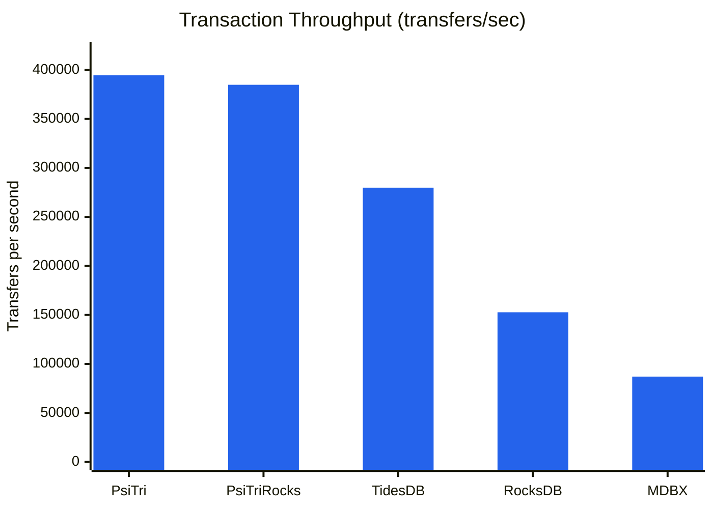
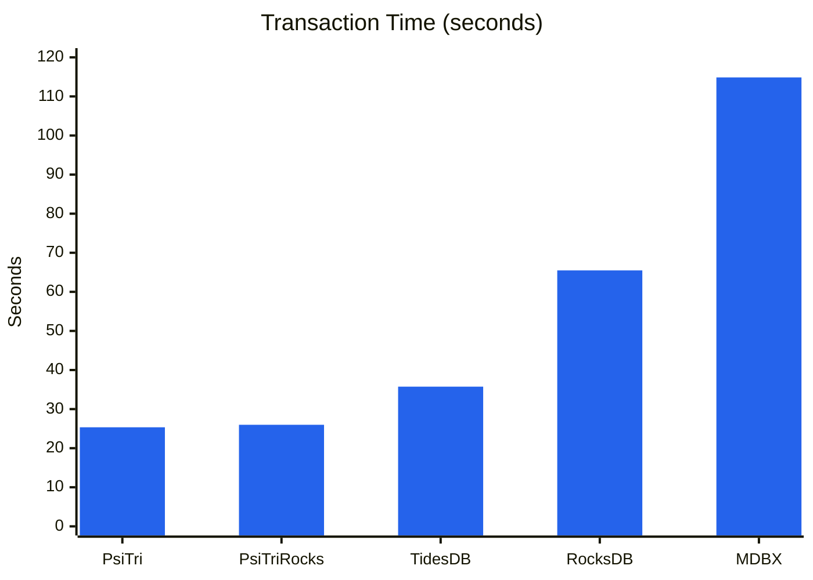
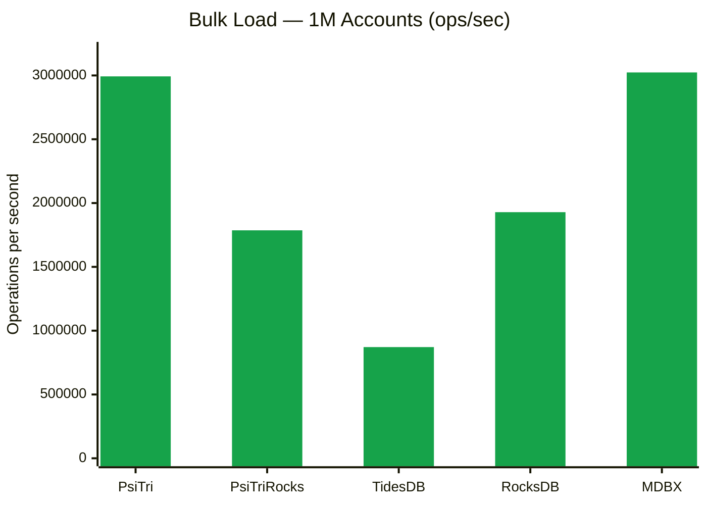
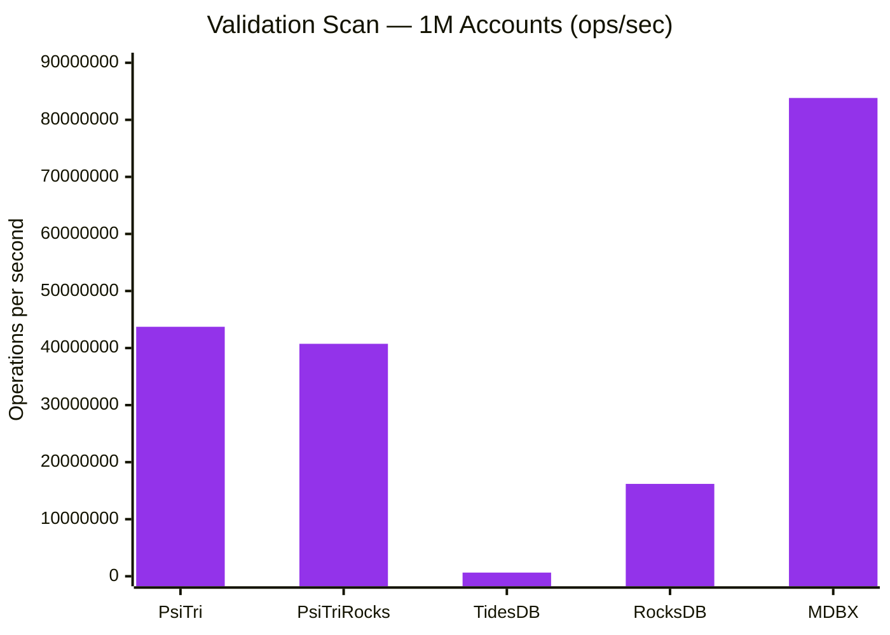
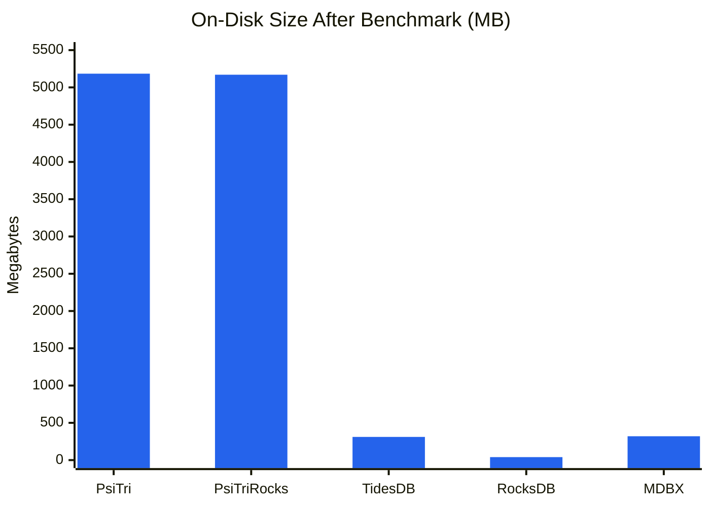

# Bank Transaction Benchmark

A realistic banking workload benchmark comparing five embedded key-value storage engines on atomic read-modify-write transactions.

## Workload

- **1,000,000 accounts** with random names (dictionary words + synthetic binary/decimal keys)
- **10,000,000 transfers** — each reads two balances, conditionally writes two updated balances
- **Triangular access distribution** — some accounts are "hot," mimicking real-world Pareto-like skew
- **~31% of transfers skip** due to insufficient balance (intentional — models realistic aborted transactions)
- **Deterministic** — identical RNG seed ensures every engine processes the exact same workload

### Fairness Controls

All engines use identical batching and sync parameters to ensure apples-to-apples comparison:

| Parameter | Value |
|-----------|-------|
| Batch size | 100 transfers per commit |
| Sync frequency | Every 100 commits |
| Sync mode | none (no forced durability) |
| Initial balance | 1,000,000 per account |
| RNG seed | 12345 |

## Results

### Transaction Throughput

The core metric — sustained transfers per second over 10M operations:



| Engine | Transfers/sec | Relative |
|--------|--------------|----------|
| **PsiTri** | **394,545** | **1.00x** |
| PsiTriRocks | 384,822 | 0.98x |
| TidesDB | 279,791 | 0.71x |
| RocksDB | 152,704 | 0.39x |
| MDBX | 87,061 | 0.22x |

### Phase Breakdown







| Engine | Bulk Load | Transactions | Validation Scan | Total |
|--------|-----------|-------------|-----------------|-------|
| **PsiTri** | 0.33s (2.99M ops/s) | 25.35s | 0.023s (43.7M ops/s) | 33.70s |
| **PsiTriRocks** | 0.56s (1.79M ops/s) | 25.99s | 0.025s (40.7M ops/s) | 26.64s |
| **TidesDB** | 1.15s (0.87M ops/s) | 35.74s | 1.555s (0.64M ops/s) | 39.09s |
| **RocksDB** | 0.52s (1.93M ops/s) | 65.49s | 0.062s (16.2M ops/s) | 66.14s |
| **MDBX** | 0.33s (3.02M ops/s) | 114.86s | 0.012s (83.8M ops/s) | 115.25s |

### Storage Efficiency



| Engine | File Size | Reported Live | Free/Reclaimable | Notes |
|--------|-----------|--------------|------------------|-------|
| **PsiTri** | 5,184 MB | 4,136 MB | 1,048 MB | See note below |
| **PsiTriRocks** | 5,170 MB | 4,144 MB | 1,027 MB | See note below |
| **TidesDB** | 311 MB | 311 MB | 0 MB | No detailed stats exposed |
| **RocksDB** | 40 MB | 23 MB | 17 MB | LSM compaction + compression |
| **MDBX** | 320 MB | 33 MB | 287 MB | COW pages accumulate between syncs |

> **Note on PsiTri/PsiTriRocks size reporting:** The "reported live" figure represents
> allocated segment space minus freed regions, but it **includes substantial internal
> free space** within the allocator (fragmentation from node splits, freed slots within
> active segments, etc.). This space is available to the allocator for future writes
> without growing the file. The actual data footprint is significantly smaller than
> the reported live size — closer to the ~33 MB that other engines report for the
> same 1M accounts with 8-byte balances. The trie structure trades space for speed:
> the allocator maintains a pool of reusable slots that enables the high write
> throughput shown above.

## Analysis

### Why PsiTri is fast

PsiTri's adaptive radix trie uses **memory-mapped copy-on-write nodes** with an arena
allocator. A transfer (2 reads + 2 writes) touches a small number of trie nodes that
are already in the page cache. There is no write-ahead log, no compaction, and no
memtable flush — writes go directly to the memory-mapped data structure. Batching
100 transfers into a single transaction amortizes the cost of the COW root update.

The RocksDB compatibility shim (PsiTriRocks) adds only ~2.5% overhead, showing that
the shim layer is thin and the underlying engine dominates performance.

### Why RocksDB is slower

RocksDB's LSM-tree architecture gives it excellent **space efficiency** (40 MB on disk
thanks to compression and compaction) but each read must potentially check the memtable,
immutable memtables, and multiple SSTable levels. The `WriteBatch` + `Get` pattern used
here requires maintaining an in-memory pending-write cache to support read-your-own-writes
within each batch.

### Why MDBX is slowest

MDBX uses a B+tree with MVCC copy-on-write. With `SAFE_NOSYNC` mode, every commit
must update the B+tree pages, but the garbage collector **cannot reclaim freed pages
until the steady meta page advances via fsync**. This is an architectural coupling:
MDBX's GC is tied to its durability mechanism. The result is that dead COW pages
accumulate (287 MB free out of 320 MB), and the working set grows beyond the CPU
cache. MDBX's sequential scan speed (83.8M ops/s) demonstrates that the B+tree
structure itself is highly efficient — the bottleneck is the per-commit overhead.

### TidesDB surprises

TidesDB's skip-list + SSTable architecture delivers 280K tx/sec — faster than both
RocksDB and MDBX. Its compact storage (311 MB) reflects efficient WAL + memtable
design. The main weakness is scan performance: without a native ordered iterator
that exposes keys, validation requires point lookups on all known account names
(643K ops/s vs. millions for cursor-based scans). TidesDB also limits transactions
to 100,000 operations, requiring chunked bulk loads.

### Validation

All five engines pass balance conservation validation: the sum of all account
balances after 10M transfers equals the initial total (1,000,000,000,000), confirming
that no money was created or destroyed. Each engine processes the same deterministic
workload and reports identical success/skip counts (6,856,951 successful, 3,143,049
skipped).

## Reproducing

```bash
# Build all engines (from repo root)
cmake -G Ninja -DCMAKE_BUILD_TYPE=Release \
      -DBUILD_ROCKSDB_BENCH=ON \
      -DBUILD_TIDESDB_BENCH=ON \
      -B build/release

cmake --build build/release -j$(nproc) --target \
      bank-bench-psitri \
      bank-bench-psitrirocks \
      bank-bench-rocksdb \
      bank-bench-mdbx \
      bank-bench-tidesdb

# Run each engine with identical parameters
for engine in psitri psitrirocks rocksdb mdbx tidesdb; do
    build/release/bin/bank-bench-${engine} \
        --num-accounts=1000000 \
        --num-transactions=10000000 \
        --batch-size=100 \
        --sync-every=100 \
        --db-path=/tmp/bb_${engine}
done
```

### CLI Options

| Flag | Default | Description |
|------|---------|-------------|
| `--num-accounts` | 1,000,000 | Number of bank accounts |
| `--num-transactions` | 10,000,000 | Number of transfer attempts |
| `--batch-size` | 1 | Transfers per commit |
| `--sync-every` | 0 | Sync to disk every N commits (0 = never) |
| `--sync-mode` | none | Durability: `none`, `async`, `sync` |
| `--seed` | 12345 | RNG seed for reproducibility |
| `--db-path` | /tmp/bank_bench_db | Database directory |
| `--initial-balance` | 1,000,000 | Starting balance per account |

## Environment

- **Hardware**: Apple M5 Max (ARM64)
- **OS**: macOS (Darwin 25.3.0)
- **Compiler**: Clang 17 (LLVM), C++20, `-O3 -flto=thin`
- **Engine versions**: RocksDB 9.9.3, libmdbx 0.13.11, TidesDB 8.9.4
